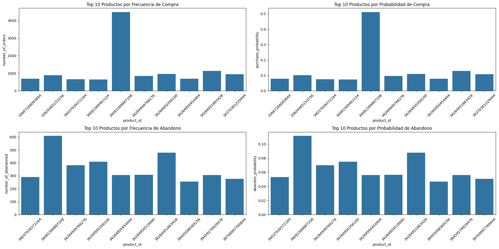
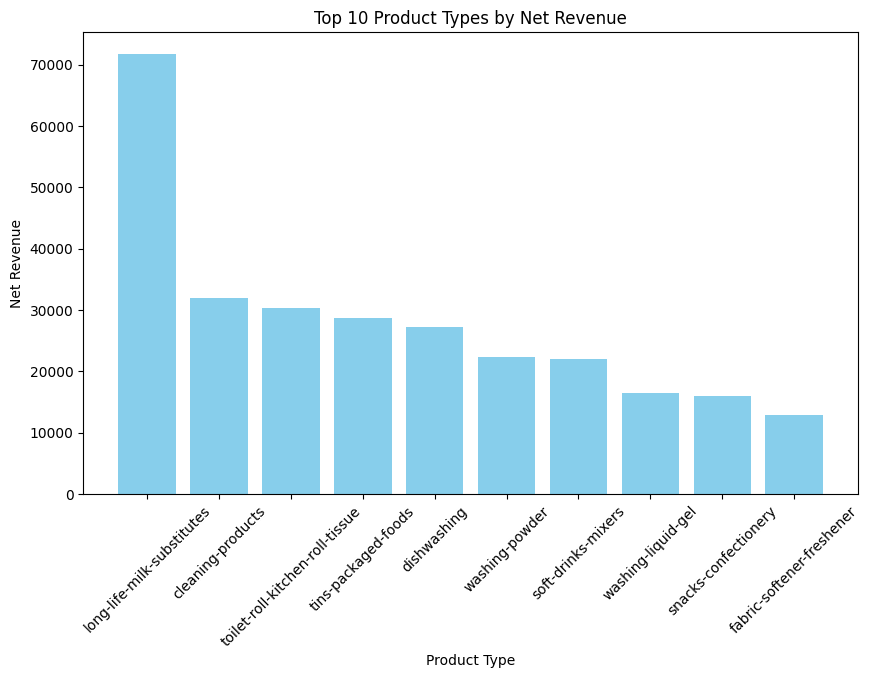
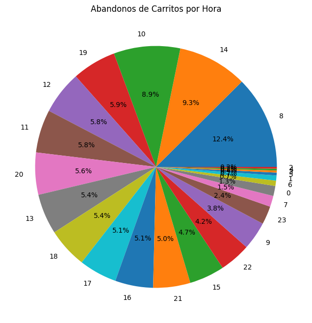
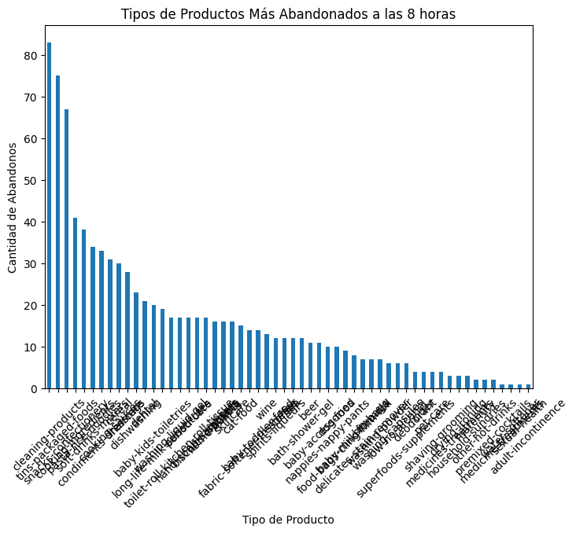
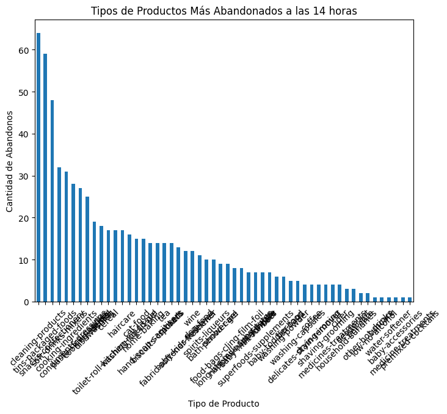
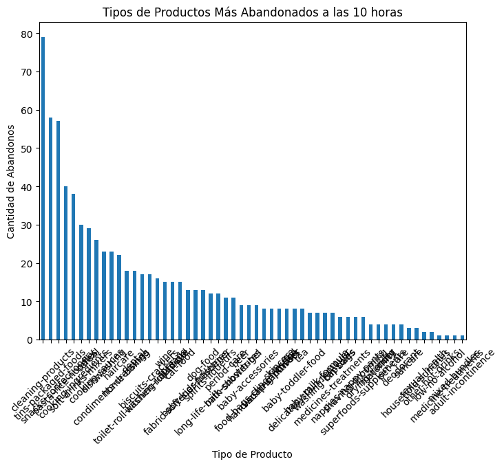

```python
import pandas as pd
from datetime import datetime
import matplotlib.pyplot as plt
import seaborn as sns
import numpy as np

```

now, let's load the datasets:


```python
df_inventory = pd.read_parquet('local_data/inventory.parquet', engine='pyarrow')
df_abandoned_carts = pd.read_parquet('local_data/abandoned_carts.parquet', engine='pyarrow')
df_orders = pd.read_parquet('local_data/orders.parquet', engine='pyarrow')
df_regulars = pd.read_parquet('local_data/regulars.parquet', engine='pyarrow')
df_users = pd.read_parquet('local_data/users.parquet', engine='pyarrow')
```

let's now check what products are the most purchased and which ones are the most abandoned:


```python
def combinar_datasets_totales(): 
    # Paso 1: Crear DataFrame de pedidos
    exploded_items = df_orders['ordered_items'].explode()  
    item_counts = exploded_items.value_counts()
    item_counts_df_orders = item_counts.reset_index()
    item_counts_df_orders.columns = ['product_id', 'number_of_orders']
    total_orders = len(df_orders)
    item_counts_df_orders['purchase_probability'] = item_counts_df_orders['number_of_orders'] / total_orders
    #print("primeros cinco df orders: ", item_counts_df_orders.head())

    # Paso 2: Crear DataFrame de carritos abandonados
    exploded_items_abandoned = df_abandoned_carts['variant_id'].explode()
    item_counts_abandoned = exploded_items_abandoned.value_counts()
    item_counts_df_abandoned = item_counts_abandoned.reset_index()
    item_counts_df_abandoned.columns = ['product_id', 'number_of_abandoned']
    total_abandoned_carts = len(df_abandoned_carts)
    item_counts_df_abandoned['abandon_probability'] = item_counts_df_abandoned['number_of_abandoned'] / total_abandoned_carts
    #print("primeros cinco df abandoned: ", item_counts_df_abandoned.head())

    # Paso 3: Filtrar para incluir solo productos en inventario
    df_orders_inventory = item_counts_df_orders[item_counts_df_orders["product_id"].isin(df_inventory["variant_id"])]
    df_abandoned_inventory = item_counts_df_abandoned[item_counts_df_abandoned["product_id"].isin(df_inventory["variant_id"])]

    # Paso 4: Combinar los DataFrames
    df_combined = df_orders_inventory.merge(df_abandoned_inventory, on="product_id", how="outer")

    # Rellenar valores NaN con 0, ya que algunos productos pueden no estar en ambos DataFrames
    df_combined.fillna(0, inplace=True)
    print(df_combined.head())
    plt.figure(figsize=(20, 10))

    # Top 10 productos por frecuencia de compra
    plt.subplot(2, 2, 1)
    sns.barplot(x='product_id', y='number_of_orders', data=df_combined.sort_values('number_of_orders', ascending=False).head(10))
    plt.title('Top 10 Productos por Frecuencia de Compra')
    plt.xticks(rotation=45)

    # Top 10 productos por probabilidad de compra
    plt.subplot(2, 2, 2)
    sns.barplot(x='product_id', y='purchase_probability', data=df_combined.sort_values('purchase_probability', ascending=False).head(10))
    plt.title('Top 10 Productos por Probabilidad de Compra')
    plt.xticks(rotation=45)

    # Top 10 productos por frecuencia de abandono
    plt.subplot(2, 2, 3)
    sns.barplot(x='product_id', y='number_of_abandoned', data=df_combined.sort_values('number_of_abandoned', ascending=False).head(10))
    plt.title('Top 10 Productos por Frecuencia de Abandono')
    plt.xticks(rotation=45)

    # Top 10 productos por probabilidad de abandono
    plt.subplot(2, 2, 4)
    sns.barplot(x='product_id', y='abandon_probability', data=df_combined.sort_values('abandon_probability', ascending=False).head(10))
    plt.title('Top 10 Productos por Probabilidad de Abandono')
    plt.xticks(rotation=45)
    
    plt.tight_layout()
    print("Guardando el gráfico...")
    plt.savefig('/home/edu/zrive-ds-1/zrive-ds/src/module_2/graphs/graph_1.png')
    print("Gráfico guardado.")
    plt.show()
    plt.close()
    
    return df_combined
    

combinar_datasets_totales()
```

           product_id  number_of_orders  purchase_probability  \
    0  33615294398596              88.0              0.010031   
    1  33667174301828              13.0              0.001482   
    2  33667174334596              15.0              0.001710   
    3  33667174465668              65.0              0.007409   
    4  33667174498436              78.0              0.008891   
    
       number_of_abandoned  abandon_probability  
    0                 18.0             0.003299  
    1                  2.0             0.000367  
    2                  4.0             0.000733  
    3                  9.0             0.001649  
    4                  6.0             0.001100  
    Guardando el gráfico...
    Gráfico guardado.


    

    


<div>
<style scoped>
    .dataframe tbody tr th:only-of-type {
        vertical-align: middle;
    }

    .dataframe tbody tr th {
        vertical-align: top;
    }

    .dataframe thead th {
        text-align: right;
    }
</style>
<table border="1" class="dataframe">
  <thead>
    <tr style="text-align: right;">
      <th></th>
      <th>product_id</th>
      <th>number_of_orders</th>
      <th>purchase_probability</th>
      <th>number_of_abandoned</th>
      <th>abandon_probability</th>
    </tr>
  </thead>
  <tbody>
    <tr>
      <th>0</th>
      <td>33615294398596</td>
      <td>88.0</td>
      <td>0.010031</td>
      <td>18.0</td>
      <td>0.003299</td>
    </tr>
    <tr>
      <th>1</th>
      <td>33667174301828</td>
      <td>13.0</td>
      <td>0.001482</td>
      <td>2.0</td>
      <td>0.000367</td>
    </tr>
    <tr>
      <th>2</th>
      <td>33667174334596</td>
      <td>15.0</td>
      <td>0.001710</td>
      <td>4.0</td>
      <td>0.000733</td>
    </tr>
    <tr>
      <th>3</th>
      <td>33667174465668</td>
      <td>65.0</td>
      <td>0.007409</td>
      <td>9.0</td>
      <td>0.001649</td>
    </tr>
    <tr>
      <th>4</th>
      <td>33667174498436</td>
      <td>78.0</td>
      <td>0.008891</td>
      <td>6.0</td>
      <td>0.001100</td>
    </tr>
    <tr>
      <th>...</th>
      <td>...</td>
      <td>...</td>
      <td>...</td>
      <td>...</td>
      <td>...</td>
    </tr>
    <tr>
      <th>1497</th>
      <td>40091799617668</td>
      <td>0.0</td>
      <td>0.000000</td>
      <td>1.0</td>
      <td>0.000183</td>
    </tr>
    <tr>
      <th>1498</th>
      <td>40091799945348</td>
      <td>1.0</td>
      <td>0.000114</td>
      <td>4.0</td>
      <td>0.000733</td>
    </tr>
    <tr>
      <th>1499</th>
      <td>40091799978116</td>
      <td>10.0</td>
      <td>0.001140</td>
      <td>6.0</td>
      <td>0.001100</td>
    </tr>
    <tr>
      <th>1500</th>
      <td>40155145044100</td>
      <td>2.0</td>
      <td>0.000228</td>
      <td>4.0</td>
      <td>0.000733</td>
    </tr>
    <tr>
      <th>1501</th>
      <td>40155145076868</td>
      <td>0.0</td>
      <td>0.000000</td>
      <td>1.0</td>
      <td>0.000183</td>
    </tr>
  </tbody>
</table>
<p>1502 rows × 5 columns</p>
</div>


one of the things we expect at first in our bussiness is that if price is reduced, customers
will be more attracted to that product than before and therefor will have a bigger purchased probability.
Let's consider a significat discount those bigger than the 20%. If there's a "significant discount", then 
we believe there'll be more purchase probability than if there was less %


```python
def probability_per_discount_check(percentage):
    data=df_inventory
    menos=[]
    mas=[]
    for index, row in data.iterrows():
        if row['compare_at_price'] == 0:
            # Opción 1: Continuar con la siguiente iteración
            continue

            # Opción 2: Establecer el porcentaje de descuento en cero o algún valor predeterminado
            # porcentaje_descuento = 0
        else:
            descuento = row['compare_at_price'] - row['price']
            porcentaje_descuento = (descuento / row['compare_at_price']) * 100

            # Comparar el porcentaje de descuento
            if porcentaje_descuento > percentage:
                mas.append(row['variant_id'])
            else:
                menos.append(row['variant_id'])
    
    # Crear subdataframes
    df_mas = data[data['variant_id'].isin(mas)]
    df_menos = data[data['variant_id'].isin(menos)]
    
    # Calcular la probabilidad de ser comprado
    total_orders = df_orders['ordered_items'].explode().value_counts()
    df_mas['purchase_probability'] = df_mas['variant_id'].apply(lambda x: total_orders.get(x, 0) / len(df_orders))
    df_menos['purchase_probability'] = df_menos['variant_id'].apply(lambda x: total_orders.get(x, 0) / len(df_orders))
    print(df_mas.head(),df_menos.head())
    return df_mas, df_menos

probability_per_discount_check(50)
```

             variant_id  price  compare_at_price vendor       product_type  \
    23   39830155034756   4.49              9.00    cif  cleaning-products   
    26   39459281272964   4.49              9.00    cif  cleaning-products   
    37   33667185279108   0.99              1.99    cif  cleaning-products   
    104  34368927170692   0.83             11.99  mutti     cooking-sauces   
    149  34369153564804   1.00              2.59  mutti     cooking-sauces   
    
                                                      tags  purchase_probability  
    23                     [kitchen-oven-cleaner, refills]              0.005243  
    26               [bathroom-limescale-cleaner, refills]              0.012310  
    37        [bathroom-limescale-cleaner, toilet-cleaner]              0.033968  
    104  [pasta-pizza-sauce, tinned-tomatoes-puree-pass...              0.000000  
    149  [pasta-pizza-sauce, tinned-tomatoes-puree-pass...              0.000000          variant_id  price  compare_at_price          vendor  \
    0  39587297165444   3.09              3.15           heinz   
    1  34370361229444   4.99              5.50   whogivesacrap   
    2  34284951863428   3.69              3.99          plenty   
    3  33667283583108   1.79              1.99  thecheekypanda   
    4  33803537973380   1.99              2.09         colgate   
    
                          product_type  \
    0             condiments-dressings   
    1  toilet-roll-kitchen-roll-tissue   
    2  toilet-roll-kitchen-roll-tissue   
    3  toilet-roll-kitchen-roll-tissue   
    4                           dental   
    
                                             tags  purchase_probability  
    0                       [table-sauces, vegan]              0.062920  
    1                 [b-corp, eco, toilet-rolls]              0.107033  
    2                              [kitchen-roll]              0.129146  
    3  [b-corp, cruelty-free, eco, tissue, vegan]              0.014704  
    4                        [dental-accessories]              0.020859  


    /tmp/ipykernel_25655/4228338435.py:28: SettingWithCopyWarning: 
    A value is trying to be set on a copy of a slice from a DataFrame.
    Try using .loc[row_indexer,col_indexer] = value instead
    
    See the caveats in the documentation: https://pandas.pydata.org/pandas-docs/stable/user_guide/indexing.html#returning-a-view-versus-a-copy
      df_mas['purchase_probability'] = df_mas['variant_id'].apply(lambda x: total_orders.get(x, 0) / len(df_orders))
    /tmp/ipykernel_25655/4228338435.py:29: SettingWithCopyWarning: 
    A value is trying to be set on a copy of a slice from a DataFrame.
    Try using .loc[row_indexer,col_indexer] = value instead
    
    See the caveats in the documentation: https://pandas.pydata.org/pandas-docs/stable/user_guide/indexing.html#returning-a-view-versus-a-copy
      df_menos['purchase_probability'] = df_menos['variant_id'].apply(lambda x: total_orders.get(x, 0) / len(df_orders))


    (          variant_id  price  compare_at_price          vendor  \
     23    39830155034756   4.49              9.00             cif   
     26    39459281272964   4.49              9.00             cif   
     37    33667185279108   0.99              1.99             cif   
     104   34368927170692   0.83             11.99           mutti   
     149   34369153564804   1.00              2.59           mutti   
     182   39459279798404   1.99              4.18        vaseline   
     184   33667185311876   0.99              1.99             cif   
     220   34173021192324   2.69              5.79          ribena   
     275   34246816923780   1.49              3.00             cif   
     394   33719433986180   1.49              2.99           oralb   
     400   39600950411396   2.69              5.56           biona   
     406   39600950378628   2.49              5.16           biona   
     460   34415988179076   1.99              3.99  herbalessences   
     585   33719435657348   1.99              3.99  herbalessences   
     619   34415986770052   1.99              3.99  herbalessences   
     677   33667228663940   1.59              3.19        johnsons   
     731   33667196092548   1.10              2.90            dove   
     750   33719435788420   1.99              3.99  herbalessences   
     752   33719435755652   1.99              3.99  herbalessences   
     825   33667228532868   1.59              3.19        johnsons   
     830   39349425340548   6.49             13.99           nivea   
     917   39459277340804   2.19              5.80            dove   
     1167  33719435722884   1.99              3.99  herbalessences   
     1186  39459283665028   1.99              4.18        vaseline   
     1218  34079207719044   6.99             13.99           nivea   
     1470  39542988898436   4.09              8.36           biona   
     1471  34246816989316   1.49              3.00             cif   
     1610  33826415706244   4.79             10.59    bamboonature   
     1630  34079207784580   6.99             13.99           nivea   
     
                   product_type                                               tags  \
     23       cleaning-products                    [kitchen-oven-cleaner, refills]   
     26       cleaning-products              [bathroom-limescale-cleaner, refills]   
     37       cleaning-products       [bathroom-limescale-cleaner, toilet-cleaner]   
     104         cooking-sauces  [pasta-pizza-sauce, tinned-tomatoes-puree-pass...   
     149         cooking-sauces  [pasta-pizza-sauce, tinned-tomatoes-puree-pass...   
     182               skincare                                  [facial-skincare]   
     184      cleaning-products                       [bathroom-limescale-cleaner]   
     220     soft-drinks-mixers                                           [squash]   
     275      cleaning-products  [bathroom-limescale-cleaner, cleaning-wipes, r...   
     394                 dental                  [toiletries & health, toothpaste]   
     400      biscuits-crackers                     [crackers, discontinue, vegan]   
     406      biscuits-crackers                                  [crackers, vegan]   
     460               haircare                            [cruelty-free, shampoo]   
     585               haircare                            [cruelty-free, shampoo]   
     619               haircare                        [conditioner, cruelty-free]   
     677               skincare      [face-wipes-cotton-wool, toiletries & health]   
     731   hand-soap-sanitisers  [hand-soap, household & cleaning, toiletries &...   
     750               haircare                        [conditioner, cruelty-free]   
     752               haircare                            [cruelty-free, shampoo]   
     825               skincare      [face-wipes-cotton-wool, toiletries & health]   
     830                suncare                    [suncream, toiletries & health]   
     917   hand-soap-sanitisers                                        [hand-soap]   
     1167              haircare                        [conditioner, cruelty-free]   
     1186              skincare                                  [facial-skincare]   
     1218               suncare                            [discontinue, suncream]   
     1470     biscuits-crackers                                  [crackers, vegan]   
     1471     cleaning-products                    [kitchen-oven-cleaner, refills]   
     1610   nappies-nappy-pants                         [discontinue, eco, size-3]   
     1630               suncare                        [discontinue, kids-suncare]   
     
           purchase_probability  
     23                0.005243  
     26                0.012310  
     37                0.033968  
     104               0.000000  
     149               0.000000  
     182               0.005243  
     184               0.018010  
     220               0.025761  
     275               0.000000  
     394               0.000000  
     400               0.001254  
     406               0.000684  
     460               0.004901  
     585               0.009461  
     619               0.003762  
     677               0.000000  
     731               0.000000  
     750               0.003306  
     752               0.002736  
     825               0.000000  
     830               0.001482  
     917               0.011171  
     1167              0.005015  
     1186              0.002052  
     1218              0.000798  
     1470              0.000798  
     1471              0.000000  
     1610              0.000000  
     1630              0.000342  ,
               variant_id  price  compare_at_price          vendor  \
     0     39587297165444   3.09              3.15           heinz   
     1     34370361229444   4.99              5.50   whogivesacrap   
     2     34284951863428   3.69              3.99          plenty   
     3     33667283583108   1.79              1.99  thecheekypanda   
     4     33803537973380   1.99              2.09         colgate   
     ...              ...    ...               ...             ...   
     1728  39539419218052   4.99              5.99          bother   
     1729  34534187368580   4.69              5.49    tommeetippee   
     1730  33826439594116  15.39             17.15          colief   
     1731  33667214508164  19.49             21.65      enterosgel   
     1732  33667214704772  31.99             34.60         eskimo3   
     
                              product_type  \
     0                condiments-dressings   
     1     toilet-roll-kitchen-roll-tissue   
     2     toilet-roll-kitchen-roll-tissue   
     3     toilet-roll-kitchen-roll-tissue   
     4                              dental   
     ...                               ...   
     1728                                    
     1729                 baby-accessories   
     1730                 baby-accessories   
     1731             medicines-treatments   
     1732           superfoods-supplements   
     
                                                 tags  purchase_probability  
     0                          [table-sauces, vegan]              0.062920  
     1                    [b-corp, eco, toilet-rolls]              0.107033  
     2                                 [kitchen-roll]              0.129146  
     3     [b-corp, cruelty-free, eco, tissue, vegan]              0.014704  
     4                           [dental-accessories]              0.020859  
     ...                                          ...                   ...  
     1728                        [household-sundries]              0.000000  
     1729                           [feeding-weaning]              0.000114  
     1730                           [feeding-weaning]              0.000000  
     1731                    [discontinue, first-aid]              0.000114  
     1732         [discontinue, vitamins-supplements]              0.000000  
     
     [1632 rows x 7 columns])


However, our analysis indicates that the impact of discounts on our product sales is minimal, unless the discount is significantly substantial to attract customer attention. This insight leads us to consider a strategic pivot for our online store. It may be prudent to concentrate our efforts on a select range of target products. Which products should these be? Let's explore this further


```python
def contar_pedidos_por_tipo(): #nos da un graph e info sobre los product_type mas demandados
    variant_info = df_inventory.set_index('variant_id')[['product_type', 'price']]

    # Filtrar variant_id en df_orders y df_abandoned_carts que están en df_inventory
    valid_variants = set(df_inventory['variant_id'])
    ordered_variants = df_orders['ordered_items'].explode().map(lambda x: x if x in valid_variants else None).dropna()
    abandoned_variants = df_abandoned_carts['variant_id'].explode().map(lambda x: x if x in valid_variants else None).dropna()
    
    # Asignar product_type y price a cada variant_id en los pedidos y en los abandonos
    ordered_variants_info = variant_info.loc[ordered_variants]
    abandoned_variants_info = variant_info.loc[abandoned_variants]

    # Calcular ingresos por variant_id
    ordered_variants_info['revenue'] = ordered_variants_info['price']
    abandoned_variants_info['lost_revenue'] = abandoned_variants_info['price']

    # Agregar y agrupar por product_type
    revenue_per_type = ordered_variants_info.groupby('product_type')['revenue'].sum()
    lost_revenue_per_type = abandoned_variants_info.groupby('product_type')['lost_revenue'].sum()
    maximized_possible_revenue = revenue_per_type + lost_revenue_per_type

    # Calcular ingresos netos por product_type
    #net_revenue_per_type = revenue_per_type - lost_revenue_per_type
    net_revenue_per_type = revenue_per_type 

    # Contar pedidos y abandonos por product_type
    order_counts = ordered_variants_info['product_type'].value_counts()
    abandoned_counts = abandoned_variants_info['product_type'].value_counts()

    # Crear un nuevo DataFrame
    top_types = pd.DataFrame({
        'order_count': order_counts,
        'abandoned_count': abandoned_counts.reindex(order_counts.index, fill_value=0),
        'net_revenue': net_revenue_per_type.reindex(order_counts.index, fill_value=0),
        'maximized_possible_revenue': maximized_possible_revenue.reindex(maximized_possible_revenue.index, fill_value=0)
    }).reset_index().rename(columns={'index': 'product_type'})

    # Ordenar por ingresos netos (net_revenue) de mayor a menor
    top_types = top_types.sort_values(by='net_revenue', ascending=False)
    
    top_types = top_types.sort_values(by='net_revenue', ascending=False)
    top_10_types = top_types.head(10)
    
    #print(top_10_types)

    # Crear un gráfico de barras para el ingreso neto de las 10 principales categorías
    plt.figure(figsize=(10, 6))
    plt.bar(top_10_types['product_type'], top_10_types['net_revenue'], color='skyblue')
    plt.xlabel('Product Type')
    plt.ylabel('Net Revenue')
    plt.title('Top 10 Product Types by Net Revenue')
    plt.xticks(rotation=45)
    print("Guardando el gráfico...")
    plt.savefig('/home/edu/zrive-ds-1/zrive-ds/src/module_2/graphs/graph_1.png')
    print("Gráfico guardado.")
    plt.show()
    plt.close()

    return top_types
contar_pedidos_por_tipo()
```

    Guardando el gráfico...
    Gráfico guardado.


    

    


<div>
<style scoped>
    .dataframe tbody tr th:only-of-type {
        vertical-align: middle;
    }

    .dataframe tbody tr th {
        vertical-align: top;
    }

    .dataframe thead th {
        text-align: right;
    }
</style>
<table border="1" class="dataframe">
  <thead>
    <tr style="text-align: right;">
      <th></th>
      <th>product_type</th>
      <th>order_count</th>
      <th>abandoned_count</th>
      <th>net_revenue</th>
      <th>maximized_possible_revenue</th>
    </tr>
  </thead>
  <tbody>
    <tr>
      <th>29</th>
      <td>long-life-milk-substitutes</td>
      <td>6637</td>
      <td>1134</td>
      <td>71736.70</td>
      <td>83952.76</td>
    </tr>
    <tr>
      <th>12</th>
      <td>cleaning-products</td>
      <td>9676</td>
      <td>2525</td>
      <td>31948.04</td>
      <td>40603.69</td>
    </tr>
    <tr>
      <th>52</th>
      <td>toilet-roll-kitchen-roll-tissue</td>
      <td>6314</td>
      <td>2257</td>
      <td>30270.66</td>
      <td>41988.29</td>
    </tr>
    <tr>
      <th>51</th>
      <td>tins-packaged-foods</td>
      <td>8959</td>
      <td>2700</td>
      <td>28662.86</td>
      <td>37653.79</td>
    </tr>
    <tr>
      <th>20</th>
      <td>dishwashing</td>
      <td>4362</td>
      <td>1694</td>
      <td>27163.98</td>
      <td>38324.04</td>
    </tr>
    <tr>
      <th>55</th>
      <td>washing-powder</td>
      <td>1475</td>
      <td>511</td>
      <td>22321.75</td>
      <td>30124.64</td>
    </tr>
    <tr>
      <th>45</th>
      <td>soft-drinks-mixers</td>
      <td>3808</td>
      <td>1769</td>
      <td>22008.82</td>
      <td>33593.13</td>
    </tr>
    <tr>
      <th>54</th>
      <td>washing-liquid-gel</td>
      <td>1482</td>
      <td>615</td>
      <td>16389.18</td>
      <td>23250.63</td>
    </tr>
    <tr>
      <th>44</th>
      <td>snacks-confectionery</td>
      <td>3787</td>
      <td>1157</td>
      <td>15958.63</td>
      <td>21548.46</td>
    </tr>
    <tr>
      <th>23</th>
      <td>fabric-softener-freshener</td>
      <td>2443</td>
      <td>1070</td>
      <td>12867.07</td>
      <td>18801.37</td>
    </tr>
    <tr>
      <th>10</th>
      <td>cereal</td>
      <td>3014</td>
      <td>700</td>
      <td>12680.46</td>
      <td>15517.46</td>
    </tr>
    <tr>
      <th>15</th>
      <td>cooking-ingredients</td>
      <td>3150</td>
      <td>928</td>
      <td>12039.30</td>
      <td>15414.92</td>
    </tr>
    <tr>
      <th>53</th>
      <td>washing-capsules</td>
      <td>1127</td>
      <td>581</td>
      <td>10983.93</td>
      <td>16715.22</td>
    </tr>
    <tr>
      <th>46</th>
      <td>spirits-liqueurs</td>
      <td>578</td>
      <td>350</td>
      <td>10077.42</td>
      <td>16274.02</td>
    </tr>
    <tr>
      <th>6</th>
      <td>beer</td>
      <td>953</td>
      <td>320</td>
      <td>9862.97</td>
      <td>13227.77</td>
    </tr>
    <tr>
      <th>37</th>
      <td>pasta-rice-noodles</td>
      <td>2443</td>
      <td>811</td>
      <td>9776.82</td>
      <td>13396.01</td>
    </tr>
    <tr>
      <th>26</th>
      <td>hand-soap-sanitisers</td>
      <td>1981</td>
      <td>563</td>
      <td>9379.59</td>
      <td>12194.66</td>
    </tr>
    <tr>
      <th>57</th>
      <td>wine</td>
      <td>1009</td>
      <td>357</td>
      <td>8882.71</td>
      <td>12088.34</td>
    </tr>
    <tr>
      <th>18</th>
      <td>dental</td>
      <td>2161</td>
      <td>809</td>
      <td>8306.91</td>
      <td>11338.73</td>
    </tr>
    <tr>
      <th>47</th>
      <td>spreads</td>
      <td>1926</td>
      <td>643</td>
      <td>8080.34</td>
      <td>10857.61</td>
    </tr>
    <tr>
      <th>16</th>
      <td>cooking-sauces</td>
      <td>2631</td>
      <td>937</td>
      <td>7978.23</td>
      <td>10971.56</td>
    </tr>
    <tr>
      <th>14</th>
      <td>condiments-dressings</td>
      <td>2821</td>
      <td>833</td>
      <td>7976.87</td>
      <td>10419.76</td>
    </tr>
    <tr>
      <th>25</th>
      <td>haircare</td>
      <td>1552</td>
      <td>507</td>
      <td>7311.18</td>
      <td>10014.31</td>
    </tr>
    <tr>
      <th>3</th>
      <td>baby-milk-formula</td>
      <td>787</td>
      <td>102</td>
      <td>7083.85</td>
      <td>8068.19</td>
    </tr>
    <tr>
      <th>9</th>
      <td>cat-food</td>
      <td>963</td>
      <td>283</td>
      <td>7082.67</td>
      <td>9385.14</td>
    </tr>
    <tr>
      <th>7</th>
      <td>bin-bags</td>
      <td>1083</td>
      <td>232</td>
      <td>5284.97</td>
      <td>6406.05</td>
    </tr>
    <tr>
      <th>50</th>
      <td>tea</td>
      <td>1232</td>
      <td>315</td>
      <td>5047.08</td>
      <td>6377.73</td>
    </tr>
    <tr>
      <th>8</th>
      <td>biscuits-crackers</td>
      <td>2008</td>
      <td>692</td>
      <td>4880.52</td>
      <td>6531.70</td>
    </tr>
    <tr>
      <th>17</th>
      <td>delicates-stain-remover</td>
      <td>648</td>
      <td>218</td>
      <td>4780.52</td>
      <td>6539.34</td>
    </tr>
    <tr>
      <th>21</th>
      <td>dog-food</td>
      <td>677</td>
      <td>208</td>
      <td>4654.13</td>
      <td>6059.15</td>
    </tr>
    <tr>
      <th>2</th>
      <td>baby-kids-toiletries</td>
      <td>825</td>
      <td>345</td>
      <td>4498.95</td>
      <td>6622.20</td>
    </tr>
    <tr>
      <th>13</th>
      <td>coffee</td>
      <td>729</td>
      <td>175</td>
      <td>4177.51</td>
      <td>5367.76</td>
    </tr>
    <tr>
      <th>5</th>
      <td>bath-shower-gel</td>
      <td>1142</td>
      <td>309</td>
      <td>3992.88</td>
      <td>5030.79</td>
    </tr>
    <tr>
      <th>27</th>
      <td>home-baking</td>
      <td>1808</td>
      <td>487</td>
      <td>3629.92</td>
      <td>4711.05</td>
    </tr>
    <tr>
      <th>35</th>
      <td>nappies-nappy-pants</td>
      <td>348</td>
      <td>131</td>
      <td>3370.12</td>
      <td>4789.11</td>
    </tr>
    <tr>
      <th>43</th>
      <td>skincare</td>
      <td>1128</td>
      <td>326</td>
      <td>3355.02</td>
      <td>4215.56</td>
    </tr>
    <tr>
      <th>28</th>
      <td>household-sundries</td>
      <td>146</td>
      <td>116</td>
      <td>3092.04</td>
      <td>5827.88</td>
    </tr>
    <tr>
      <th>24</th>
      <td>food-bags-cling-film-foil</td>
      <td>848</td>
      <td>310</td>
      <td>2741.72</td>
      <td>3719.82</td>
    </tr>
    <tr>
      <th>4</th>
      <td>baby-toddler-food</td>
      <td>484</td>
      <td>116</td>
      <td>2521.99</td>
      <td>3183.63</td>
    </tr>
    <tr>
      <th>38</th>
      <td>period-care</td>
      <td>1026</td>
      <td>316</td>
      <td>2420.64</td>
      <td>3054.98</td>
    </tr>
    <tr>
      <th>39</th>
      <td>pet-care</td>
      <td>238</td>
      <td>52</td>
      <td>2287.02</td>
      <td>2861.40</td>
    </tr>
    <tr>
      <th>49</th>
      <td>superfoods-supplements</td>
      <td>159</td>
      <td>107</td>
      <td>1818.17</td>
      <td>3088.64</td>
    </tr>
    <tr>
      <th>11</th>
      <td>cider</td>
      <td>215</td>
      <td>114</td>
      <td>1790.35</td>
      <td>2857.61</td>
    </tr>
    <tr>
      <th>1</th>
      <td>baby-accessories</td>
      <td>307</td>
      <td>111</td>
      <td>1578.63</td>
      <td>2301.42</td>
    </tr>
    <tr>
      <th>42</th>
      <td>shaving-grooming</td>
      <td>205</td>
      <td>83</td>
      <td>1247.25</td>
      <td>1765.02</td>
    </tr>
    <tr>
      <th>19</th>
      <td>deodorant</td>
      <td>299</td>
      <td>75</td>
      <td>1101.91</td>
      <td>1350.36</td>
    </tr>
    <tr>
      <th>56</th>
      <td>water-softener</td>
      <td>82</td>
      <td>21</td>
      <td>730.08</td>
      <td>913.67</td>
    </tr>
    <tr>
      <th>22</th>
      <td>drying-ironing</td>
      <td>245</td>
      <td>75</td>
      <td>634.65</td>
      <td>881.80</td>
    </tr>
    <tr>
      <th>36</th>
      <td>other-hot-drinks</td>
      <td>68</td>
      <td>33</td>
      <td>573.32</td>
      <td>884.29</td>
    </tr>
    <tr>
      <th>40</th>
      <td>premixed-cocktails</td>
      <td>29</td>
      <td>9</td>
      <td>556.21</td>
      <td>725.62</td>
    </tr>
    <tr>
      <th>41</th>
      <td>sexual-health</td>
      <td>42</td>
      <td>12</td>
      <td>538.08</td>
      <td>703.96</td>
    </tr>
    <tr>
      <th>33</th>
      <td>medicines-treatments</td>
      <td>97</td>
      <td>72</td>
      <td>384.63</td>
      <td>663.31</td>
    </tr>
    <tr>
      <th>30</th>
      <td>low-no-alcohol</td>
      <td>58</td>
      <td>39</td>
      <td>294.46</td>
      <td>527.55</td>
    </tr>
    <tr>
      <th>31</th>
      <td>maternity</td>
      <td>40</td>
      <td>20</td>
      <td>283.40</td>
      <td>424.10</td>
    </tr>
    <tr>
      <th>0</th>
      <td>adult-incontinence</td>
      <td>39</td>
      <td>7</td>
      <td>278.61</td>
      <td>357.14</td>
    </tr>
    <tr>
      <th>48</th>
      <td>suncare</td>
      <td>38</td>
      <td>13</td>
      <td>271.12</td>
      <td>360.49</td>
    </tr>
    <tr>
      <th>32</th>
      <td>medicine-treatments</td>
      <td>27</td>
      <td>30</td>
      <td>103.83</td>
      <td>216.23</td>
    </tr>
    <tr>
      <th>34</th>
      <td>mixed-bundles</td>
      <td>2</td>
      <td>3</td>
      <td>64.98</td>
      <td>207.95</td>
    </tr>
  </tbody>
</table>
</div>


We can see the net revenue per product type, which is caluclated using the total sales. There's a huge difference between some of the product types; which basically can lead to either focusing on increasing those sales of the products with less revenue, maybe with more ads or any marketing strategy for it, or just focusing in a very specific nicht. Also we can see that due to abandoned carts there's being lost a lot of possible income to the bussiness. Therefore, another important aspect we could analyse is how to reduce the amount of these abandoned carts. When are more succesful orders? Should we create a strategy to increase sales at determined times? 


```python
def best_users_product_type():
    # Mapear variant_id a product_type
    variant_info = df_inventory.set_index('variant_id')[['product_type', 'price']].to_dict('index')

    # Expandir los items ordenados y abandonados en df_orders y df_abandoned_carts
    expanded_orders = df_orders.explode('ordered_items')
    expanded_abandoned = df_abandoned_carts.explode('variant_id')

    # Filtrar variant_id en df_orders y df_abandoned_carts que están en df_inventory
    valid_variants = set(df_inventory['variant_id'])
    expanded_orders = expanded_orders[expanded_orders['ordered_items'].isin(valid_variants)]
    expanded_abandoned = expanded_abandoned[expanded_abandoned['variant_id'].isin(valid_variants)]

    # Asignar product_type y price a cada variant_id en los pedidos y abandonos
    expanded_orders['product_type'] = expanded_orders['ordered_items'].map(lambda x: variant_info[x]['product_type'])
    expanded_orders['price'] = expanded_orders['ordered_items'].map(lambda x: variant_info[x]['price'])
    expanded_abandoned['product_type'] = expanded_abandoned['variant_id'].map(lambda x: variant_info[x]['product_type'])

    # Función para manejar grupos vacíos al encontrar el product_type más común
    def most_common_product_type(x):
        if len(x) > 0:
            return x.value_counts().idxmax()
        else:
            return None

    # Contar pedidos, abandonos y encontrar product_type más común por user_id
    user_order_counts = expanded_orders['user_id'].value_counts()
    user_abandoned_counts = expanded_abandoned['user_id'].value_counts()
    most_bought_product_type = expanded_orders.groupby('user_id')['product_type'].agg(most_common_product_type)
    most_abandoned_product_type = expanded_abandoned.groupby('user_id')['product_type'].agg(most_common_product_type)

    # Calcular el revenue por usuario
    revenue_per_user = expanded_orders.groupby('user_id')['price'].sum()

   # Crear un nuevo DataFrame
    best_users = pd.DataFrame({
        'user_id': user_order_counts.index,
        'order_count': user_order_counts,
        'most_bought_product_type': most_bought_product_type,
        'abandoned_count': user_abandoned_counts.reindex(user_order_counts.index, fill_value=0),
        'most_abandoned_product_type': most_abandoned_product_type.reindex(user_order_counts.index),
        'revenue': revenue_per_user
    }).reset_index(drop=True)

    # Ordenar el DataFrame por 'revenue' en orden descendente
    best_users = best_users.sort_values(by='revenue', ascending=False)

    print(best_users.head())
    return best_users

best_users_product_type()
```

                                                    user_id  order_count  \
    83    d7d080eceb0168ebdff0002e4c8e1dcc3fd1912c602c95...          311   
    3635  29299f2e8ca82be713e716c0de8738f0e5f9c878f4de7a...          167   
    3242  d26a41d67114911b309aa68d94ab32a47334af761e6a29...          448   
    2260  4021cf86ce45a4fe0793a16fa6c5f8c0fc104d56cf93a4...          383   
    1258  f49d903f33fde7436da05a2dc6eddebff62cd9ca552121...          337   
    
                 most_bought_product_type  abandoned_count  \
    83                             cereal                5   
    3635       long-life-milk-substitutes                7   
    3242             snacks-confectionery               47   
    2260                cleaning-products                6   
    1258  toilet-roll-kitchen-roll-tissue               41   
    
         most_abandoned_product_type  revenue  
    83          snacks-confectionery  1969.99  
    3635  long-life-milk-substitutes  1781.73  
    3242          pasta-rice-noodles  1756.21  
    2260           cleaning-products  1738.17  
    1258                 dishwashing  1617.47  


<div>
<style scoped>
    .dataframe tbody tr th:only-of-type {
        vertical-align: middle;
    }

    .dataframe tbody tr th {
        vertical-align: top;
    }

    .dataframe thead th {
        text-align: right;
    }
</style>
<table border="1" class="dataframe">
  <thead>
    <tr style="text-align: right;">
      <th></th>
      <th>user_id</th>
      <th>order_count</th>
      <th>most_bought_product_type</th>
      <th>abandoned_count</th>
      <th>most_abandoned_product_type</th>
      <th>revenue</th>
    </tr>
  </thead>
  <tbody>
    <tr>
      <th>83</th>
      <td>d7d080eceb0168ebdff0002e4c8e1dcc3fd1912c602c95...</td>
      <td>311</td>
      <td>cereal</td>
      <td>5</td>
      <td>snacks-confectionery</td>
      <td>1969.99</td>
    </tr>
    <tr>
      <th>3635</th>
      <td>29299f2e8ca82be713e716c0de8738f0e5f9c878f4de7a...</td>
      <td>167</td>
      <td>long-life-milk-substitutes</td>
      <td>7</td>
      <td>long-life-milk-substitutes</td>
      <td>1781.73</td>
    </tr>
    <tr>
      <th>3242</th>
      <td>d26a41d67114911b309aa68d94ab32a47334af761e6a29...</td>
      <td>448</td>
      <td>snacks-confectionery</td>
      <td>47</td>
      <td>pasta-rice-noodles</td>
      <td>1756.21</td>
    </tr>
    <tr>
      <th>2260</th>
      <td>4021cf86ce45a4fe0793a16fa6c5f8c0fc104d56cf93a4...</td>
      <td>383</td>
      <td>cleaning-products</td>
      <td>6</td>
      <td>cleaning-products</td>
      <td>1738.17</td>
    </tr>
    <tr>
      <th>1258</th>
      <td>f49d903f33fde7436da05a2dc6eddebff62cd9ca552121...</td>
      <td>337</td>
      <td>toilet-roll-kitchen-roll-tissue</td>
      <td>41</td>
      <td>dishwashing</td>
      <td>1617.47</td>
    </tr>
    <tr>
      <th>...</th>
      <td>...</td>
      <td>...</td>
      <td>...</td>
      <td>...</td>
      <td>...</td>
      <td>...</td>
    </tr>
    <tr>
      <th>1756</th>
      <td>769555ec9d277b7fa4a55e7f5c00f27017afbb52cc5056...</td>
      <td>2</td>
      <td>tins-packaged-foods</td>
      <td>0</td>
      <td>NaN</td>
      <td>2.98</td>
    </tr>
    <tr>
      <th>1654</th>
      <td>70b771db8fe2d0c96f12e1b53b472ea646f16be0f7ce34...</td>
      <td>1</td>
      <td>cooking-ingredients</td>
      <td>0</td>
      <td>NaN</td>
      <td>2.29</td>
    </tr>
    <tr>
      <th>89</th>
      <td>864e7f2d544ae108b74798fcfc61b4cf23e16d84921f35...</td>
      <td>1</td>
      <td>cleaning-products</td>
      <td>0</td>
      <td>NaN</td>
      <td>1.99</td>
    </tr>
    <tr>
      <th>1507</th>
      <td>2d4dca7ab4ae6e5b3fc418d971ee8ad74462d63093db04...</td>
      <td>1</td>
      <td>cooking-ingredients</td>
      <td>1</td>
      <td>cooking-ingredients</td>
      <td>0.99</td>
    </tr>
    <tr>
      <th>2458</th>
      <td>fb0f385e8eb9595411cddee4e4aadc1de728be7c709be1...</td>
      <td>1</td>
      <td>skincare</td>
      <td>0</td>
      <td>NaN</td>
      <td>0.99</td>
    </tr>
  </tbody>
</table>
<p>4948 rows × 6 columns</p>
</div>


As we can see, the favourite product types of the clients with highest revenues are among the most bought product types. So now, the main aspect to check is, when is the time where more carts are abandoned and what type of products belong to these carts? 


```python
def analyze_abandoned_carts():
    # Convertir timestamp a hora
    df_abandoned_carts['hour'] = df_abandoned_carts['created_at'].dt.hour

    # Conteo de abandonos por hora
    hour_counts = df_abandoned_carts['hour'].value_counts()

    # Gráfico circular de abandonos por hora
    plt.figure(figsize=(8, 8))
    hour_counts.plot(kind='pie', autopct='%1.1f%%')
    plt.title('Abandonos de Carritos por Hora')
    plt.ylabel('')
    plt.show()

    # Obtener las tres horas con más abandonos
    top_hours = hour_counts.head(3).index

    # Analizar los tipos de productos más abandonados en esas horas
    for hour in top_hours:
        # Filtrar carritos abandonados en la hora específica
        hour_abandoned = df_abandoned_carts[df_abandoned_carts['hour'] == hour]
        
        # Obtener los variant_id y luego los product_type
        variant_ids = hour_abandoned['variant_id'].explode()
        product_types = df_inventory[df_inventory['variant_id'].isin(variant_ids)]['product_type']

        # Conteo de product_types
        product_type_counts = product_types.value_counts()

        # Gráfico de los tipos de productos abandonados
        plt.figure(figsize=(8, 6))
        product_type_counts.plot(kind='bar')
        plt.title(f'Tipos de Productos Más Abandonados a las {hour} horas')
        plt.xlabel('Tipo de Producto')
        plt.ylabel('Cantidad de Abandonos')
        plt.xticks(rotation=45)
   

        print("Guardando el gráfico...")
        plt.savefig('/home/edu/zrive-ds-1/zrive-ds/src/module_2/graphs/graph_1.png')
        print("Gráfico guardado.")
        plt.show()
        plt.close()
        
analyze_abandoned_carts()
        
```


    

    


    Guardando el gráfico...
    Gráfico guardado.


    

    


    Guardando el gráfico...
    Gráfico guardado.


    

    


    Guardando el gráfico...
    Gráfico guardado.


    

    


The most carts abandoned are at 8 am, probably because people is in a rush in the morning, at 10 am and at 14 pm. At all these times, the most abandoned product type is the cleaning products. Who likes cleaning? and who likes cleaning in the morning or just when you are hungry at 14h?
