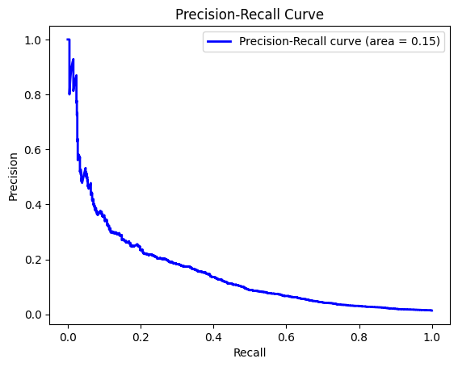

```python
import logging
import pandas as pd
from datetime import datetime
import matplotlib.pyplot as plt
import seaborn as sns
import numpy as np
```

First of all, let's load the dataset and filter it so that we can get only those orders which have 5 or more products on it:


```python
data=pd.read_csv("feature_frames.csv")
filtered_data = data[data['user_order_seq'] > 5]
logging.basicConfig(level=logging.INFO, format='%(asctime)s - %(levelname)s - %(message)s')
logging.info("Las primeras filas del DataFrame son:\n%s", filtered_data.head().to_string())

```

    2024-02-06 21:47:58,492 - INFO - Las primeras filas del DataFrame son:
            variant_id     product_type       order_id        user_id           created_at           order_date  user_order_seq  outcome  ordered_before  abandoned_before  active_snoozed  set_as_regular  normalised_price  discount_pct       vendor  global_popularity  count_adults  count_children  count_babies  count_pets  people_ex_baby  days_since_purchase_variant_id  avg_days_to_buy_variant_id  std_days_to_buy_variant_id  days_since_purchase_product_type  avg_days_to_buy_product_type  std_days_to_buy_product_type
    7   33826472919172  ricepastapulses  2808549900420  3437017956484  2020-10-06 14:24:26  2020-10-06 00:00:00              13      0.0             0.0               0.0             0.0             0.0          0.081052      0.053512  clearspring           0.038462           2.0             0.0           0.0         0.0             2.0                            33.0                        42.0                   31.134053                              30.0                          30.0                      24.27618
    12  33826472919172  ricepastapulses  2809061539972  3437017956484  2020-10-07 08:48:22  2020-10-07 00:00:00              14      0.0             0.0               0.0             0.0             0.0          0.081052      0.053512  clearspring           0.026316           2.0             0.0           0.0         0.0             2.0                            33.0                        42.0                   31.134053                              30.0                          30.0                      24.27618
    13  33826472919172  ricepastapulses  2809064751236  3437017956484  2020-10-07 08:58:46  2020-10-07 00:00:00              15      0.0             0.0               0.0             0.0             0.0          0.081052      0.053512  clearspring           0.026316           2.0             0.0           0.0         0.0             2.0                            33.0                        42.0                   31.134053                              30.0                          30.0                      24.27618
    17  33826472919172  ricepastapulses  2809189335172  3223115595908  2020-10-07 13:54:54  2020-10-07 00:00:00               9      0.0             0.0               0.0             0.0             0.0          0.081052      0.053512  clearspring           0.026316           2.0             0.0           0.0         0.0             2.0                            33.0                        42.0                   31.134053                              30.0                          30.0                      24.27618
    27  33826472919172  ricepastapulses  2811283374212  3437823688836  2020-10-08 11:51:28  2020-10-08 00:00:00               6      0.0             0.0               0.0             0.0             0.0          0.081052      0.053512  clearspring           0.039683           2.0             0.0           0.0         0.0             2.0                            33.0                        42.0                   31.134053                              30.0                          30.0                      24.27618


LINEAL MODELS

for the POC, we will start analysing some linear models.

Before doing so, let's check which variables may be more influent on the decision of making an order. Instead of doing it by intuition, let's check with the correlation matrix. The purpose of this is reducing overfitting.


```python
df = pd.DataFrame(filtered_data)
df_numeric = df.select_dtypes(include=[np.number])
correlation_matrix = df_numeric.corr()
logging.info("correlation matrix:\n%s",correlation_matrix)

plt.figure(figsize=(10, 8))  
sns.heatmap(correlation_matrix, annot=True, fmt=".2f", cmap='coolwarm', 
            cbar=True, square=True, linewidths=.5)

plt.show()

```

    2024-02-06 21:51:24,290 - INFO - correlation matrix:
                                      variant_id  order_id   user_id  \
    variant_id                          1.000000  0.092340  0.055808   
    order_id                            0.092340  1.000000  0.244780   
    user_id                             0.055808  0.244780  1.000000   
    user_order_seq                      0.001654  0.012672 -0.395196   
    outcome                             0.023811 -0.002848 -0.018644   
    ordered_before                     -0.050871 -0.018179 -0.047676   
    abandoned_before                   -0.000225 -0.007747 -0.005435   
    active_snoozed                     -0.090176 -0.028793 -0.084046   
    set_as_regular                     -0.005723  0.028609  0.013799   
    normalised_price                   -0.013617  0.017779  0.008473   
    discount_pct                       -0.112025 -0.011877 -0.006636   
    global_popularity                   0.082147 -0.035902 -0.029731   
    count_adults                        0.011750  0.062565  0.026388   
    count_children                     -0.013571 -0.011276 -0.253855   
    count_babies                       -0.020548 -0.009333 -0.068763   
    count_pets                         -0.004301  0.031461 -0.191498   
    people_ex_baby                     -0.003661  0.027979 -0.182120   
    days_since_purchase_variant_id     -0.015348  0.030988 -0.000820   
    avg_days_to_buy_variant_id         -0.279312 -0.052687 -0.034187   
    std_days_to_buy_variant_id         -0.332749 -0.046813 -0.039065   
    days_since_purchase_product_type    0.011439  0.055419 -0.047878   
    avg_days_to_buy_product_type       -0.226371 -0.056674 -0.028088   
    std_days_to_buy_product_type       -0.251872 -0.068685 -0.033148   
    
                                      user_order_seq   outcome  ordered_before  \
    variant_id                              0.001654  0.023811       -0.050871   
    order_id                                0.012672 -0.002848       -0.018179   
    user_id                                -0.395196 -0.018644       -0.047676   
    user_order_seq                          1.000000  0.006088        0.090832   
    outcome                                 0.006088  1.000000        0.212617   
    ordered_before                          0.090832  0.212617        1.000000   
    abandoned_before                       -0.004334  0.108448        0.032596   
    active_snoozed                          0.064111  0.078853        0.400189   
    set_as_regular                          0.021407  0.160692        0.329212   
    normalised_price                        0.001105 -0.020769       -0.062536   
    discount_pct                           -0.000267 -0.000255        0.004072   
    global_popularity                      -0.000883  0.161102        0.162394   
    count_adults                           -0.076121  0.004239        0.001731   
    count_children                          0.158204  0.010119        0.010158   
    count_babies                            0.300731  0.001285        0.022496   
    count_pets                              0.098335  0.011998        0.018753   
    people_ex_baby                          0.078437  0.010367        0.008925   
    days_since_purchase_variant_id          0.046936  0.036187        0.374014   
    avg_days_to_buy_variant_id             -0.002859 -0.025140        0.021288   
    std_days_to_buy_variant_id             -0.003490 -0.011713        0.048972   
    days_since_purchase_product_type        0.011750  0.001473        0.019295   
    avg_days_to_buy_product_type           -0.002523 -0.018418        0.005037   
    std_days_to_buy_product_type           -0.002722 -0.012955        0.016174   
    
                                      abandoned_before  active_snoozed  \
    variant_id                               -0.000225       -0.090176   
    order_id                                 -0.007747       -0.028793   
    user_id                                  -0.005435       -0.084046   
    user_order_seq                           -0.004334        0.064111   
    outcome                                   0.108448        0.078853   
    ordered_before                            0.032596        0.400189   
    abandoned_before                          1.000000        0.020994   
    active_snoozed                            0.020994        1.000000   
    set_as_regular                            0.014617        0.114051   
    normalised_price                          0.001784       -0.020471   
    discount_pct                              0.003508        0.011081   
    global_popularity                         0.038550        0.057430   
    count_adults                             -0.000454       -0.001217   
    count_children                           -0.001726        0.039525   
    count_babies                              0.004237        0.037621   
    count_pets                               -0.003891        0.036169   
    people_ex_baby                           -0.001610        0.030055   
    days_since_purchase_variant_id           -0.004492        0.063395   
    avg_days_to_buy_variant_id               -0.001332        0.019068   
    std_days_to_buy_variant_id                0.000992        0.036799   
    days_since_purchase_product_type         -0.003831        0.009467   
    avg_days_to_buy_product_type             -0.003296        0.023883   
    std_days_to_buy_product_type             -0.003683        0.027087   
    
                                      set_as_regular  normalised_price  ...  \
    variant_id                             -0.005723         -0.013617  ...   
    order_id                                0.028609          0.017779  ...   
    user_id                                 0.013799          0.008473  ...   
    user_order_seq                          0.021407          0.001105  ...   
    outcome                                 0.160692         -0.020769  ...   
    ordered_before                          0.329212         -0.062536  ...   
    abandoned_before                        0.014617          0.001784  ...   
    active_snoozed                          0.114051         -0.020471  ...   
    set_as_regular                          1.000000         -0.012071  ...   
    normalised_price                       -0.012071          1.000000  ...   
    discount_pct                           -0.003584         -0.063652  ...   
    global_popularity                       0.091991         -0.104967  ...   
    count_adults                            0.019656          0.001701  ...   
    count_children                          0.007494         -0.000926  ...   
    count_babies                            0.003726         -0.001396  ...   
    count_pets                              0.005571          0.000802  ...   
    people_ex_baby                          0.017382          0.000278  ...   
    days_since_purchase_variant_id          0.171020         -0.030010  ...   
    avg_days_to_buy_variant_id             -0.009972          0.000509  ...   
    std_days_to_buy_variant_id              0.002290         -0.024585  ...   
    days_since_purchase_product_type        0.021128         -0.038283  ...   
    avg_days_to_buy_product_type           -0.005683         -0.078308  ...   
    std_days_to_buy_product_type           -0.002898         -0.150597  ...   
    
                                      count_children  count_babies  count_pets  \
    variant_id                             -0.013571     -0.020548   -0.004301   
    order_id                               -0.011276     -0.009333    0.031461   
    user_id                                -0.253855     -0.068763   -0.191498   
    user_order_seq                          0.158204      0.300731    0.098335   
    outcome                                 0.010119      0.001285    0.011998   
    ordered_before                          0.010158      0.022496    0.018753   
    abandoned_before                       -0.001726      0.004237   -0.003891   
    active_snoozed                          0.039525      0.037621    0.036169   
    set_as_regular                          0.007494      0.003726    0.005571   
    normalised_price                       -0.000926     -0.001396    0.000802   
    discount_pct                            0.001813      0.003403    0.000865   
    global_popularity                       0.009890      0.015937    0.005082   
    count_adults                            0.053341     -0.032082    0.104113   
    count_children                          1.000000      0.225481    0.615614   
    count_babies                            0.225481      1.000000    0.242310   
    count_pets                              0.615614      0.242310    1.000000   
    people_ex_baby                          0.809825      0.156685    0.540414   
    days_since_purchase_variant_id          0.000919     -0.002224    0.002515   
    avg_days_to_buy_variant_id              0.008125      0.012293    0.001940   
    std_days_to_buy_variant_id              0.011942      0.017086    0.005078   
    days_since_purchase_product_type        0.036434     -0.018784    0.020474   
    avg_days_to_buy_product_type            0.003696      0.007267   -0.001259   
    std_days_to_buy_product_type            0.004585      0.008692   -0.001440   
    
                                      people_ex_baby  \
    variant_id                             -0.003661   
    order_id                                0.027979   
    user_id                                -0.182120   
    user_order_seq                          0.078437   
    outcome                                 0.010367   
    ordered_before                          0.008925   
    abandoned_before                       -0.001610   
    active_snoozed                          0.030055   
    set_as_regular                          0.017382   
    normalised_price                        0.000278   
    discount_pct                            0.000762   
    global_popularity                       0.004067   
    count_adults                            0.629034   
    count_children                          0.809825   
    count_babies                            0.156685   
    count_pets                              0.540414   
    people_ex_baby                          1.000000   
    days_since_purchase_variant_id          0.004817   
    avg_days_to_buy_variant_id              0.001306   
    std_days_to_buy_variant_id              0.003422   
    days_since_purchase_product_type        0.021021   
    avg_days_to_buy_product_type           -0.000176   
    std_days_to_buy_product_type            0.000096   
    
                                      days_since_purchase_variant_id  \
    variant_id                                             -0.015348   
    order_id                                                0.030988   
    user_id                                                -0.000820   
    user_order_seq                                          0.046936   
    outcome                                                 0.036187   
    ordered_before                                          0.374014   
    abandoned_before                                       -0.004492   
    active_snoozed                                          0.063395   
    set_as_regular                                          0.171020   
    normalised_price                                       -0.030010   
    discount_pct                                           -0.002057   
    global_popularity                                       0.017756   
    count_adults                                            0.006982   
    count_children                                          0.000919   
    count_babies                                           -0.002224   
    count_pets                                              0.002515   
    people_ex_baby                                          0.004817   
    days_since_purchase_variant_id                          1.000000   
    avg_days_to_buy_variant_id                              0.044457   
    std_days_to_buy_variant_id                              0.053035   
    days_since_purchase_product_type                        0.170943   
    avg_days_to_buy_product_type                            0.011062   
    std_days_to_buy_product_type                            0.014192   
    
                                      avg_days_to_buy_variant_id  \
    variant_id                                         -0.279312   
    order_id                                           -0.052687   
    user_id                                            -0.034187   
    user_order_seq                                     -0.002859   
    outcome                                            -0.025140   
    ordered_before                                      0.021288   
    abandoned_before                                   -0.001332   
    active_snoozed                                      0.019068   
    set_as_regular                                     -0.009972   
    normalised_price                                    0.000509   
    discount_pct                                        0.022143   
    global_popularity                                  -0.093344   
    count_adults                                       -0.008544   
    count_children                                      0.008125   
    count_babies                                        0.012293   
    count_pets                                          0.001940   
    people_ex_baby                                      0.001306   
    days_since_purchase_variant_id                      0.044457   
    avg_days_to_buy_variant_id                          1.000000   
    std_days_to_buy_variant_id                          0.599301   
    days_since_purchase_product_type                    0.006736   
    avg_days_to_buy_product_type                        0.292680   
    std_days_to_buy_product_type                        0.251318   
    
                                      std_days_to_buy_variant_id  \
    variant_id                                         -0.332749   
    order_id                                           -0.046813   
    user_id                                            -0.039065   
    user_order_seq                                     -0.003490   
    outcome                                            -0.011713   
    ordered_before                                      0.048972   
    abandoned_before                                    0.000992   
    active_snoozed                                      0.036799   
    set_as_regular                                      0.002290   
    normalised_price                                   -0.024585   
    discount_pct                                        0.023635   
    global_popularity                                  -0.030851   
    count_adults                                       -0.009998   
    count_children                                      0.011942   
    count_babies                                        0.017086   
    count_pets                                          0.005078   
    people_ex_baby                                      0.003422   
    days_since_purchase_variant_id                      0.053035   
    avg_days_to_buy_variant_id                          0.599301   
    std_days_to_buy_variant_id                          1.000000   
    days_since_purchase_product_type                    0.005712   
    avg_days_to_buy_product_type                        0.223562   
    std_days_to_buy_product_type                        0.254693   
    
                                      days_since_purchase_product_type  \
    variant_id                                                0.011439   
    order_id                                                  0.055419   
    user_id                                                  -0.047878   
    user_order_seq                                            0.011750   
    outcome                                                   0.001473   
    ordered_before                                            0.019295   
    abandoned_before                                         -0.003831   
    active_snoozed                                            0.009467   
    set_as_regular                                            0.021128   
    normalised_price                                         -0.038283   
    discount_pct                                             -0.002865   
    global_popularity                                        -0.001314   
    count_adults                                             -0.012498   
    count_children                                            0.036434   
    count_babies                                             -0.018784   
    count_pets                                                0.020474   
    people_ex_baby                                            0.021021   
    days_since_purchase_variant_id                            0.170943   
    avg_days_to_buy_variant_id                                0.006736   
    std_days_to_buy_variant_id                                0.005712   
    days_since_purchase_product_type                          1.000000   
    avg_days_to_buy_product_type                              0.057753   
    std_days_to_buy_product_type                              0.060606   
    
                                      avg_days_to_buy_product_type  \
    variant_id                                           -0.226371   
    order_id                                             -0.056674   
    user_id                                              -0.028088   
    user_order_seq                                       -0.002523   
    outcome                                              -0.018418   
    ordered_before                                        0.005037   
    abandoned_before                                     -0.003296   
    active_snoozed                                        0.023883   
    set_as_regular                                       -0.005683   
    normalised_price                                     -0.078308   
    discount_pct                                          0.154722   
    global_popularity                                    -0.061818   
    count_adults                                         -0.005197   
    count_children                                        0.003696   
    count_babies                                          0.007267   
    count_pets                                           -0.001259   
    people_ex_baby                                       -0.000176   
    days_since_purchase_variant_id                        0.011062   
    avg_days_to_buy_variant_id                            0.292680   
    std_days_to_buy_variant_id                            0.223562   
    days_since_purchase_product_type                      0.057753   
    avg_days_to_buy_product_type                          1.000000   
    std_days_to_buy_product_type                          0.838103   
    
                                      std_days_to_buy_product_type  
    variant_id                                           -0.251872  
    order_id                                             -0.068685  
    user_id                                              -0.033148  
    user_order_seq                                       -0.002722  
    outcome                                              -0.012955  
    ordered_before                                        0.016174  
    abandoned_before                                     -0.003683  
    active_snoozed                                        0.027087  
    set_as_regular                                       -0.002898  
    normalised_price                                     -0.150597  
    discount_pct                                          0.151040  
    global_popularity                                    -0.044680  
    count_adults                                         -0.005912  
    count_children                                        0.004585  
    count_babies                                          0.008692  
    count_pets                                           -0.001440  
    people_ex_baby                                        0.000096  
    days_since_purchase_variant_id                        0.014192  
    avg_days_to_buy_variant_id                            0.251318  
    std_days_to_buy_variant_id                            0.254693  
    days_since_purchase_product_type                      0.060606  
    avg_days_to_buy_product_type                          0.838103  
    std_days_to_buy_product_type                          1.000000  
    
    [23 rows x 23 columns]


    

    


So my predictible variable will be "outcome", which will represent the probability of a user buying a determined product when a notification shows up.

For doing so, I`m first going to divide de dataset into X and y. I will for this purpose consider not relevant many columns such as the order_id for example. Nevertheless, I will include some details such as the day of the week that the order was made, the hour, or the year station.


```python
df['created_at'] = pd.to_datetime(df['created_at'])
df['order_date'] = pd.to_datetime(df['order_date'])

def get_season(month):
    if month in [12, 1, 2]:
        return 1  # winter
    elif month in [3, 4, 5]:
        return 2  # spring
    elif month in [6, 7, 8]:
        return 3  # summer
    else:
        return 4  # Outumn


df['season'] = df['order_date'].dt.month.apply(get_season)

df['day_of_week'] = df['order_date'].dt.dayofweek
df['is_weekend'] = df['order_date'].dt.dayofweek >= 5
df['hour_of_day'] = df['order_date'].dt.hour

X = df.drop(['variant_id', 'order_id', 'user_id', 'created_at', 'order_date', 'outcome'], axis=1)
X = pd.concat([X, df[['day_of_week', 'is_weekend', 'hour_of_day']]], axis=1)
y = df['outcome']

logging.info("Las primeras filas de X son:\n%s", X.head().to_string())

```

    2024-02-06 21:51:30,937 - INFO - Las primeras filas de X son:
           product_type  user_order_seq  ordered_before  abandoned_before  active_snoozed  set_as_regular  normalised_price  discount_pct       vendor  global_popularity  count_adults  count_children  count_babies  count_pets  people_ex_baby  days_since_purchase_variant_id  avg_days_to_buy_variant_id  std_days_to_buy_variant_id  days_since_purchase_product_type  avg_days_to_buy_product_type  std_days_to_buy_product_type  season  day_of_week  is_weekend  hour_of_day  day_of_week  is_weekend  hour_of_day
    7   ricepastapulses              13             0.0               0.0             0.0             0.0          0.081052      0.053512  clearspring           0.038462           2.0             0.0           0.0         0.0             2.0                            33.0                        42.0                   31.134053                              30.0                          30.0                      24.27618       4            1       False            0            1       False            0
    12  ricepastapulses              14             0.0               0.0             0.0             0.0          0.081052      0.053512  clearspring           0.026316           2.0             0.0           0.0         0.0             2.0                            33.0                        42.0                   31.134053                              30.0                          30.0                      24.27618       4            2       False            0            2       False            0
    13  ricepastapulses              15             0.0               0.0             0.0             0.0          0.081052      0.053512  clearspring           0.026316           2.0             0.0           0.0         0.0             2.0                            33.0                        42.0                   31.134053                              30.0                          30.0                      24.27618       4            2       False            0            2       False            0
    17  ricepastapulses               9             0.0               0.0             0.0             0.0          0.081052      0.053512  clearspring           0.026316           2.0             0.0           0.0         0.0             2.0                            33.0                        42.0                   31.134053                              30.0                          30.0                      24.27618       4            2       False            0            2       False            0
    27  ricepastapulses               6             0.0               0.0             0.0             0.0          0.081052      0.053512  clearspring           0.039683           2.0             0.0           0.0         0.0             2.0                            33.0                        42.0                   31.134053                              30.0                          30.0                      24.27618       4            3       False            0            3       False            0


Now that we have divided our X & y ; let's try to select among the variables we have, which ones are the most importants. For this purpose, I will use the Random Forest Classifier.


```python
from sklearn.ensemble import RandomForestClassifier
from sklearn.model_selection import train_test_split
X_encoded = pd.get_dummies(X)
X_train, X_test, y_train, y_test = train_test_split(X_encoded, y, test_size=0.2, random_state=42)
model = RandomForestClassifier()
model.fit(X_train, y_train)

importances = model.feature_importances_

feature_importances = pd.Series(importances, index=X_train.columns).sort_values(ascending=False)

logging.info("model results are:\n%s", feature_importances.to_string())

top_features = feature_importances[:7]

plt.figure(figsize=(10, 8))
top_features.plot(kind='bar')
plt.title('Top 7 Feature Importances in RandomForest Model')
plt.xlabel('Feature')
plt.ylabel('Importance')
plt.xticks(rotation=45, ha="right")
plt.tight_layout()  
plt.show()
```

    2024-02-06 21:52:36,765 - INFO - model results are:
    global_popularity                          1.850694e-01
    days_since_purchase_product_type           1.102643e-01
    user_order_seq                             1.017108e-01
    days_since_purchase_variant_id             5.711776e-02
    day_of_week                                4.471979e-02
    day_of_week                                4.463121e-02
    std_days_to_buy_variant_id                 4.174202e-02
    avg_days_to_buy_variant_id                 3.885395e-02
    ordered_before                             3.359488e-02
    discount_pct                               3.348541e-02
    normalised_price                           2.991944e-02
    count_pets                                 2.261599e-02
    season                                     1.884816e-02
    set_as_regular                             1.840745e-02
    people_ex_baby                             1.603569e-02
    std_days_to_buy_product_type               1.509945e-02
    count_children                             1.262232e-02
    avg_days_to_buy_product_type               1.221922e-02
    count_adults                               1.030787e-02
    abandoned_before                           9.722814e-03
    active_snoozed                             9.209249e-03
    is_weekend                                 6.155316e-03
    is_weekend                                 6.056691e-03
    vendor_biona                               3.216035e-03
    count_babies                               3.001383e-03
    product_type_tinspackagedfoods             2.259125e-03
    product_type_cereal                        2.087245e-03
    vendor_oatly                               1.852532e-03
    product_type_condimentsdressings           1.814781e-03
    vendor_treeoflife                          1.783676e-03
    vendor_ecover                              1.730198e-03
    product_type_ricepastapulses               1.700315e-03
    product_type_cookingingredientsoils        1.509374e-03
    vendor_heinz                               1.487392e-03
    product_type_dishwasherdetergent           1.457805e-03
    vendor_wholeearth                          1.417938e-03
    product_type_jamhoneyspreads               1.412934e-03
    vendor_method                              1.398991e-03
    product_type_bathroomlimescalecleaner      1.373394e-03
    product_type_kitchenrolltissues            1.331162e-03
    product_type_snacksconfectionery           1.275212e-03
    vendor_clearspring                         1.178040e-03
    vendor_mutti                               1.159287e-03
    product_type_dental                        1.073748e-03
    vendor_tonyschocolonely                    1.064278e-03
    product_type_homebaking                    1.049148e-03
    product_type_tea                           1.036206e-03
    vendor_ambrosia                            9.835495e-04
    vendor_cooksco                             9.797921e-04
    product_type_longlifemilksubstitutes       9.768418e-04
    product_type_handsoapsanitisers            9.745113e-04
    vendor_fairy                               9.249973e-04
    product_type_driedfruitsnutsseeds          9.043812e-04
    product_type_pickledfoodolives             8.958798e-04
    vendor_pipnut                              8.829732e-04
    product_type_coffee                        8.567543e-04
    product_type_allpurposecleaner             8.444521e-04
    product_type_catfood                       8.243263e-04
    vendor_tatelyle                            8.081865e-04
    product_type_softdrinksmixers              7.984492e-04
    product_type_toiletroll                    7.888668e-04
    vendor_branston                            7.680387e-04
    vendor_pukka                               7.528248e-04
    vendor_thecheekypanda                      7.419947e-04
    vendor_jordans                             7.355051e-04
    vendor_felix                               7.276215e-04
    product_type_cleaningaccessories           7.107476e-04
    vendor_cif                                 7.097409e-04
    vendor_finish                              7.028615e-04
    vendor_cocacola                            6.983046e-04
    product_type_binbags                       6.883667e-04
    vendor_kelloggs                            6.827135e-04
    product_type_juicesquash                   6.742343e-04
    vendor_biod                                6.606354e-04
    vendor_kleenex                             6.572546e-04
    product_type_fabricconditionerfreshener    6.538814e-04
    vendor_plenty                              6.534917e-04
    vendor_simplygentle                        6.531146e-04
    vendor_fish4ever                           6.468958e-04
    vendor_dashwater                           6.234339e-04
    vendor_persil                              6.108018e-04
    vendor_bluedragon                          6.083387e-04
    vendor_seventhgeneration                   6.014764e-04
    product_type_wipescottonwool               5.849813e-04
    vendor_rowse                               5.739741e-04
    vendor_tropicalwholefoods                  5.694234e-04
    product_type_washingliquidgel              5.654567e-04
    vendor_matthewscotswoldflour               5.640714e-04
    vendor_whogivesacrap                       5.620890e-04
    vendor_clipper                             5.577447e-04
    vendor_kallo                               5.567209e-04
    vendor_faithinnature                       5.536222e-04
    vendor_marmite                             5.530496e-04
    vendor_buitoni                             5.503450e-04
    vendor_nestle                              5.490874e-04
    vendor_crespo                              5.392010e-04
    product_type_cookingsaucesmarinades        5.275577e-04
    product_type_bathshowergel                 5.246614e-04
    vendor_dovesfarm                           5.174506e-04
    vendor_andrex                              5.150224e-04
    vendor_knorr                               5.077186e-04
    product_type_haircare                      5.071242e-04
    vendor_taylorsofharrogate                  5.070717e-04
    vendor_carex                               5.033861e-04
    vendor_nairns                              4.921937e-04
    vendor_sanex                               4.848816e-04
    vendor_symphony                            4.824979e-04
    vendor_duck                                4.802611e-04
    vendor_dorsetcereals                       4.682286e-04
    vendor_ritz                                4.651820e-04
    vendor_flash                               4.649030e-04
    vendor_stdalfour                           4.620235e-04
    vendor_hellmanns                           4.516021e-04
    vendor_lenor                               4.502613e-04
    vendor_bisto                               4.463160e-04
    vendor_weetabix                            4.272816e-04
    vendor_aspall                              4.186467e-04
    vendor_cafédirect                          4.178371e-04
    vendor_oralb                               4.113589e-04
    vendor_ecozone                             4.104807e-04
    vendor_marigold                            4.039898e-04
    vendor_colmans                             4.029471e-04
    vendor_verylazy                            3.978662e-04
    vendor_nescafé                             3.943507e-04
    vendor_colgate                             3.926745e-04
    vendor_sensodyne                           3.883974e-04
    vendor_listerine                           3.870954e-04
    product_type_kitchenovencleaner            3.847009e-04
    product_type_femininecare                  3.845376e-04
    vendor_ryvita                              3.831320e-04
    vendor_robinsons                           3.813288e-04
    vendor_propercorn                          3.801297e-04
    vendor_bakers                              3.765202e-04
    vendor_organix                             3.756455e-04
    vendor_bother                              3.744409e-04
    vendor_drogheriaalimentari                 3.680113e-04
    vendor_fevertree                           3.673616e-04
    product_type_babytoiletries                3.612871e-04
    product_type_foodstorage                   3.604087e-04
    vendor_cocofina                            3.576784e-04
    vendor_kingfisher                          3.537509e-04
    vendor_twinings                            3.507180e-04
    vendor_tilda                               3.500996e-04
    product_type_washingcapsules               3.462671e-04
    vendor_lovebeautyplanet                    3.434915e-04
    vendor_spam                                3.424484e-04
    vendor_merchantgourmet                     3.392041e-04
    vendor_dove                                3.343250e-04
    vendor_difatti                             3.338534e-04
    vendor_ellaskitchen                        3.314976e-04
    vendor_febreze                             3.289737e-04
    vendor_comfort                             3.260122e-04
    vendor_rudehealth                          3.243159e-04
    vendor_flashpgp                            3.209072e-04
    vendor_waterwipes                          3.202309e-04
    vendor_pukkateas                           3.195386e-04
    product_type_shavinggrooming               3.143056e-04
    vendor_natracare                           3.103266e-04
    vendor_maldon                              3.069939e-04
    vendor_wingyip                             3.048160e-04
    vendor_wilkinsons                          3.042474e-04
    product_type_kidssnacks                    2.979336e-04
    vendor_princes                             2.962262e-04
    vendor_crazyjack                           2.955194e-04
    vendor_vegó                                2.894631e-04
    vendor_ecoforce                            2.884425e-04
    vendor_originalsource                      2.865799e-04
    vendor_bulldog                             2.857079e-04
    vendor_ribena                              2.831381e-04
    product_type_deodorant                     2.828819e-04
    product_type_nappypants                    2.766417e-04
    vendor_daioni                              2.716856e-04
    vendor_7up                                 2.712623e-04
    vendor_viakal                              2.677096e-04
    product_type_babyfood6months               2.642144e-04
    vendor_nandos                              2.618054e-04
    vendor_mcvities                            2.612425e-04
    vendor_cawstonpress                        2.600829e-04
    product_type_floorcleanerpolish            2.580760e-04
    vendor_batchelors                          2.547310e-04
    vendor_ecloth                              2.536160e-04
    vendor_cadbury                             2.534643e-04
    vendor_huggies                             2.521836e-04
    vendor_karmacola                           2.520783e-04
    vendor_westlab                             2.486115e-04
    product_type_dogfood                       2.461445e-04
    vendor_calgon                              2.447935e-04
    vendor_nescafe                             2.444682e-04
    vendor_pgtips                              2.434892e-04
    vendor_robertsons                          2.401034e-04
    vendor_headshoulders                       2.364582e-04
    vendor_quaker                              2.348109e-04
    vendor_whiskas                             2.341801e-04
    vendor_nutella                             2.332793e-04
    vendor_delmonte                            2.303173e-04
    vendor_sealapack                           2.299884e-04
    vendor_hp                                  2.275182e-04
    vendor_carnation                           2.231071e-04
    vendor_dettol                              2.161962e-04
    vendor_dreamies                            2.147619e-04
    vendor_droetker                            2.019810e-04
    product_type_delicatesstainremover         1.948126e-04
    vendor_radox                               1.935674e-04
    vendor_paxo                                1.917369e-04
    vendor_zoflora                             1.914023e-04
    product_type_petcare                       1.897295e-04
    vendor_sanchi                              1.874145e-04
    vendor_tabascooriginalred                  1.861473e-04
    vendor_humblebrush                         1.852719e-04
    vendor_encore                              1.822716e-04
    vendor_johnsons                            1.801335e-04
    vendor_kitkin                              1.796913e-04
    vendor_kühne                               1.794990e-04
    vendor_allinsons                           1.787830e-04
    vendor_mrmuscle                            1.776949e-04
    vendor_yarrah                              1.761654e-04
    product_type_bodyskincare                  1.741901e-04
    vendor_rizopia                             1.696658e-04
    vendor_hollings                            1.691980e-04
    vendor_silverspoon                         1.680089e-04
    vendor_baxters                             1.676734e-04
    vendor_harrybrand                          1.670127e-04
    vendor_tampax                              1.668454e-04
    vendor_lilyskitchen                        1.661880e-04
    vendor_biobag                              1.651004e-04
    vendor_artisangrains                       1.623903e-04
    vendor_filippoberio                        1.621344e-04
    vendor_vaseline                            1.611547e-04
    vendor_scotts                              1.609672e-04
    vendor_sunwheel                            1.601914e-04
    vendor_kabutonoodles                       1.565709e-04
    vendor_profusion                           1.542034e-04
    vendor_ifyoucare                           1.539587e-04
    vendor_leaperrins                          1.528885e-04
    vendor_eatnatural                          1.498029e-04
    vendor_always                              1.421854e-04
    vendor_amadin                              1.413740e-04
    vendor_sparesnacks                         1.406423e-04
    vendor_alpro                               1.350612e-04
    product_type_healthcarevitamins            1.350513e-04
    vendor_gillette                            1.290689e-04
    vendor_vanish                              1.288608e-04
    vendor_bluediamond                         1.281433e-04
    vendor_properchips                         1.281251e-04
    vendor_totm                                1.274702e-04
    product_type_superfoodssupplements         1.274025e-04
    vendor_quinolamothergrain                  1.268627e-04
    vendor_fohwa                               1.265147e-04
    vendor_shreddedwheat                       1.262453e-04
    product_type_washingpowder                 1.243831e-04
    vendor_ape                                 1.242971e-04
    vendor_cadburys                            1.235145e-04
    vendor_panteneprov                         1.211814e-04
    vendor_bacofoil                            1.208880e-04
    vendor_ariel                               1.194920e-04
    vendor_hambledenhibiscustea                1.193846e-04
    vendor_koko                                1.189834e-04
    vendor_vo5                                 1.173526e-04
    product_type_nappies                       1.168216e-04
    vendor_covermatebytouch                    1.158021e-04
    vendor_spare                               1.134028e-04
    vendor_karmadrinks                         1.081542e-04
    product_type_facialskincare                1.044032e-04
    vendor_fody                                1.022955e-04
    vendor_dualit                              9.867297e-05
    vendor_tresemme                            9.857448e-05
    vendor_braggs                              9.600282e-05
    vendor_pulsin                              9.474560e-05
    vendor_kikkoman                            9.428090e-05
    vendor_shreddies                           9.373962e-05
    product_type_beer                          9.094222e-05
    product_type_windowglasscleaner            8.984575e-05
    vendor_frenchs                             8.620051e-05
    vendor_thenaturalfamilyco                  8.545101e-05
    product_type_dryingironing                 8.043533e-05
    vendor_hartleys                            7.960902e-05
    vendor_betterbodyfoods                     7.609993e-05
    vendor_meridian                            7.497073e-05
    vendor_vitacoco                            7.452734e-05
    vendor_brewdog                             6.762536e-05
    vendor_heineken                            6.003031e-05
    vendor_bobsredmill                         5.884848e-05
    vendor_lynx                                5.853613e-05
    vendor_simple                              5.789355e-05
    vendor_linwoods                            5.532041e-05
    vendor_freee                               5.371542e-05
    vendor_bart                                5.337904e-05
    vendor_kingsoba                            5.225603e-05
    product_type_premixedcocktails             5.058117e-05
    vendor_flora                               5.057386e-05
    vendor_minorfigures                        4.808375e-05
    vendor_pampers                             4.658436e-05
    vendor_maryberrys                          4.581384e-05
    vendor_carlsberg                           3.619448e-05
    vendor_childsfarm                          3.611836e-05
    vendor_budweiserbudvar                     3.172854e-05
    vendor_navitas                             2.953172e-05
    vendor_stardrops                           2.927728e-05
    vendor_spontex                             2.781998e-05
    vendor_drty                                2.767670e-05
    vendor_pedigree                            2.717127e-05
    vendor_bamboonature                        2.542771e-05
    vendor_vitalbaby                           2.436235e-05
    vendor_herbalessences                      2.312967e-05
    vendor_annabelkarmel                       2.277785e-05
    vendor_mrsheen                             2.012922e-05
    vendor_redbull                             1.927313e-05
    vendor_piccolo                             1.565942e-05
    vendor_fourpurebrewingcompany              1.484904e-05
    vendor_littlepastaorganics                 1.436831e-05
    vendor_maistic                             1.393929e-05
    vendor_wellbaby                            1.287604e-05
    vendor_beamingbaby                         1.271328e-05
    vendor_nivea                               1.166908e-05
    vendor_pregnacare                          1.043657e-05
    vendor_nuk                                 1.026478e-05
    product_type_airfreshener                  9.620518e-06
    vendor_brooklyn                            9.110944e-06
    vendor_saltoftheearth                      8.262717e-06
    product_type_feedingweaning                7.404996e-06
    product_type_babyfood12months              6.707599e-06
    vendor_greenpeople                         6.647174e-06
    vendor_jacknjill                           6.395178e-06
    product_type_babymilkformula               5.562437e-06
    vendor_brita                               5.420597e-06
    vendor_minky                               5.274348e-06
    vendor_weleda                              5.018217e-06
    vendor_provamel                            4.622468e-06
    product_type_householdsundries             4.578806e-06
    vendor_hipporganic                         4.478974e-06
    vendor_pantene                             4.385672e-06
    vendor_tommeetippee                        3.968556e-06
    product_type_kidsdental                    3.017021e-06
    vendor_lansinoh                            2.896011e-06
    vendor_ffs                                 2.812934e-06
    vendor_cowgate                             2.647614e-06
    vendor_enterosgel                          2.143133e-06
    vendor_aptamil                             1.719715e-06
    product_type_maternity                     1.494686e-06
    vendor_munchkin                            1.447739e-06
    vendor_loreal                              1.246180e-06
    vendor_malibu                              7.184560e-07
    vendor_equazen                             6.255340e-07
    vendor_creativenature                      5.068376e-07
    vendor_schmidts                            3.912397e-07
    vendor_colief                              3.369840e-07
    vendor_bimuno                              3.317712e-07
    vendor_catsan                              2.331773e-07
    vendor_milton                              1.904904e-07
    vendor_vicks                               1.298166e-07
    hour_of_day                                0.000000e+00
    hour_of_day                                0.000000e+00


    

    


Based on the result of our model; we had obtained several conclutions:

"Global_popularity" is the most significant feature in your model with an importance of approximately 0.1837, indicating it greatly influences user interest predictions. "Days_since_purchase_product_type" and "user_order_seq" also matter, with importances around 0.1113 and 0.1029, showing they're key but less so than global popularity.

"Days_since_purchase_variant_id" and "day_of_week" have lower importances (about 0.0578 and 0.0447), suggesting their minor yet present impact on predictions. Features with minimal or zero importance, like vendor names and "hour_of_day" (notably listed twice with zero importance), appear to have little to no impact, hinting at potential data processing errors or interpretation issues.

We can see that for this model, these features are not significant at all.

NOW, LET'S START WITH LOGISTIC REGRESSION:


```python
from sklearn.preprocessing import StandardScaler
from sklearn.linear_model import LogisticRegression
from sklearn.metrics import accuracy_score, classification_report

scaler = StandardScaler()
X_train_scaled = scaler.fit_transform(X_train)
X_test_scaled = scaler.transform(X_test)

model_lr = LogisticRegression(max_iter=1000)  
model_lr.fit(X_train_scaled, y_train)

y_pred = model_lr.predict(X_test_scaled)
accuracy = accuracy_score(y_test, y_pred)
logging.info("Accuracy of the Logistic Regression model: %s", accuracy)

report = classification_report(y_test, y_pred)
logging.info("Classification report:\n%s", report)

```

    2024-02-06 21:58:30,437 - INFO - Accuracy of the Logistic Regression model: 0.9862093292795593
    2024-02-06 21:58:30,634 - INFO - Classification report:
                  precision    recall  f1-score   support
    
             0.0       0.99      1.00      0.99     58698
             1.0       0.68      0.03      0.06       835
    
        accuracy                           0.99     59533
       macro avg       0.84      0.52      0.53     59533
    weighted avg       0.98      0.99      0.98     59533
    


The Logistic Regression model achieves 98.62% accuracy, indicating high overall performance. However, it excels at identifying the majority class (0.0) with nearly 99% precision and 100% recall but struggles with the minority class (1.0), showing only 69% precision and a mere 3% recall. This discrepancy suggests difficulties in detecting the less frequent class, likely due to class imbalance. Macro averages reveal the challenge with a lower performance on the minority class.

For this purpose, I am just going to redo the logistic regression as follows, with the aim of assigning weights inversely proportional to class frequencies. This ensures less frequent classes gain higher importance during training, enhancing model performance on these classes.


```python
model_lr = LogisticRegression(max_iter=1000, class_weight='balanced')
model_lr.fit(X_train_scaled, y_train)

y_pred = model_lr.predict(X_test_scaled)
accuracy = accuracy_score(y_test, y_pred)
logging.info("Accuracy of the Logistic Regression model: %s", accuracy)

report = classification_report(y_test, y_pred)
logging.info("Classification report:\n%s", report)

```

    2024-02-05 16:59:37,792 - INFO - Accuracy of the Logistic Regression model: 0.8401222851191776
    2024-02-05 16:59:38,099 - INFO - Classification report:
                  precision    recall  f1-score   support
    
             0.0       0.99      0.84      0.91     58698
             1.0       0.06      0.66      0.10       835
    
        accuracy                           0.84     59533
       macro avg       0.53      0.75      0.51     59533
    weighted avg       0.98      0.84      0.90     59533
    


Now, the accuracy has decreased but there's a bigger recall for the minority class

Let's visualize these results with the ROC curve:


```python
from sklearn.metrics import roc_curve, auc, precision_recall_curve, average_precision_score, log_loss

y_probs = model_lr.predict_proba(X_test_scaled)[:, 1]

roc_auc = auc(*roc_curve(y_test, y_probs)[:2])

fpr, tpr, thresholds = roc_curve(y_test, y_probs)
plt.figure()
plt.plot(fpr, tpr, label='ROC curve (area = %0.2f)' % roc_auc)
plt.plot([0, 1], [0, 1], 'k--')
plt.xlim([0.0, 1.0])
plt.ylim([0.0, 1.05])
plt.xlabel('False Positive Rate')
plt.ylabel('True Positive Rate')
plt.title('Receiver Operating Characteristic')
plt.legend(loc="lower right")
plt.show()

```


    

    


The ROC curve indicates a binary classifier's performance, with an AUC of 0.78 suggesting good discriminative ability. The curve stays well above the line of randomness (diagonal dashed line, AUC = 0.5), indicating that the classifier is useful. The graph implies that as the threshold is varied, the classifier achieves a reasonable balance between sensitivity and specificity. The model is notably better than a random guess but not perfect, with some room for improvement.

And now, the precision-recall curve:


```python
precision, recall, _ = precision_recall_curve(y_test, y_probs)
average_precision = average_precision_score(y_test, y_probs)

plt.figure()
plt.plot(recall, precision, label='Precision-Recall curve (area = %0.2f)' % average_precision)
plt.xlabel('Recall')
plt.ylabel('Precision')
plt.title('Precision-Recall Curve')
plt.legend(loc="lower left")
plt.show()

```


    

    


This curve shows a model with high initial precision and very low recall, indicating accurate but infrequent positive predictions. As recall increases, precision drops sharply, suggesting the model incorrectly predicts more negatives as positives. The low area under the curve (AUC = 0.12) implies overall poor model performance in classifying the positive class in a binary classification task.

The model is biased toward the majority class, identifying most of its instances correctly but at the cost of misclassifying many instances of the minority class as the majority class.
The low precision but high recall for the minority class indicates the model is overpredicting the minority class, resulting in a high number of false positives.


LET'S TRY SOME OTHER LINEAR MODELS. I'M GOING TO DIRECTLY AVOID USING LINEAR REGRESSION SINCE THE OUTPUT I WANT TO VERIFY IS NOT CONTINUOUS. BUT I'M GOING TO DO THE FOLLOWING LINEAR MODELS:  LDA, SVM WITH LINEAR KERNEL, STOCHASTIC GRADIENT DESCENT & GENERALIZED LINEAR MODELS. AFTER DOING SO, I AM GOING TO EVALUATE THE BEST MODEL FOR OUR GOAL USING EXPERIMENTATION OR CROSS VALIDATION.

UP TO NOW, OPTING FOR LINEAR REGRESSION OVER LASSO HINGES ON VALUING SIMPLICITY AND CLEAR INTERPRETABILITY. LINEAR REGRESSION'S DIRECT COEFFICIENT INTERPRETATION OFFERS INSIGHTS INTO HOW PREDICTORS IMPACT THE OUTCOME, IDEAL WHEN ALL VARIABLES ARE RELEVANT AND THE GOAL IS TO UNDERSTAND THEIR INFLUENCE WITHOUT THE COMPLEXITY OF LASSO'S REGULARIZATION. THIS APPROACH IS PREFERABLE IN LOW-DIMENSIONAL DATA WHERE MODEL TRANSPARENCY AND EASE OF EXPLANATION TO STAKEHOLDERS ARE KEY, MAKING IT A STRAIGHTFORWARD CHOICE FOR PROJECTS EMPHASIZING THE ELUCIDATION OF PREDICTOR EFFECTS.

THIS IS WHY LINEAR REGRESSION IS THE BEST APPROACH UP TO THIS POINT. WILL IT STILL BE AFTER TRYING WITH ALL THESE DIFFERENT MODELS?


LET'S NOW GO WITH LDA


```python
from sklearn.discriminant_analysis import LinearDiscriminantAnalysis
from sklearn.metrics import accuracy_score, confusion_matrix, classification_report, roc_curve, auc, precision_recall_curve, average_precision_score
import matplotlib.pyplot as plt
import numpy as np

lda = LinearDiscriminantAnalysis()
lda.fit(X_train_scaled, y_train)
y_pred_lda = lda.predict(X_test_scaled)
y_score_lda = lda.decision_function(X_test_scaled)

accuracy_lda = accuracy_score(y_test, y_pred_lda)
logging.info("Accuracy:\n%s",accuracy_lda)

logging.info("Classification report:\n%s",classification_report(y_test, y_pred_lda))

conf_matrix = confusion_matrix(y_test, y_pred_lda)
logging.info("Confussion matrix:\n%s", conf_matrix)

fpr, tpr, thresholds = roc_curve(y_test, y_score_lda)
roc_auc = auc(fpr, tpr)
plt.figure()
plt.plot(fpr, tpr, color='darkorange', lw=2, label='ROC curve (area = %0.2f)' % roc_auc)
plt.plot([0, 1], [0, 1], color='navy', lw=2, linestyle='--')
plt.xlim([0.0, 1.0])
plt.ylim([0.0, 1.05])
plt.xlabel('False Positive Rate')
plt.ylabel('True Positive Rate')
plt.title('Receiver Operating Characteristic (ROC)')
plt.legend(loc="lower right")
plt.show()

precision, recall, _ = precision_recall_curve(y_test, y_score_lda)
average_precision = average_precision_score(y_test, y_score_lda)
plt.figure()
plt.plot(recall, precision, color='blue', lw=2, label='Precision-Recall curve (area = %0.2f)' % average_precision)
plt.xlabel('Recall')
plt.ylabel('Precision')
plt.title('Precision-Recall Curve')
plt.legend(loc="upper right")
plt.show()


```

    Accuracy: 0.9858733811499505
                  precision    recall  f1-score   support
    
             0.0       0.99      1.00      0.99     58698
             1.0       0.47      0.06      0.11       835
    
        accuracy                           0.99     59533
       macro avg       0.73      0.53      0.55     59533
    weighted avg       0.98      0.99      0.98     59533
    
    Confusion Matrix:
     [[58641    57]
     [  784    51]]


    

    


    

    


    BIC: 767818.1644885644


The LDA model achieved an impressive overall accuracy of 98.587%, indicating high effectiveness in classifying the dataset. While it excellently identified the majority class (0.0) with high precision and recall, its performance on the minority class (1.0) was less effective, with a precision of 0.18, but a low recall (0.06). The F1-score for the minority class (0.11) suggests room for improvement in balancing precision and recall. The confusion matrix reveals the model correctly classified a significant portion of the majority class but also had a moderate number of false positives (57) and false negatives (784), indicating challenges in accurately predicting the minority class.

Also, the ROC curve area is pretty big, 0.81, and the area under the precission recall curve is bigger than the one in logistic regression, with a value of 0,15; but it's still small

Let's now check for the linear SVM:


```python
from sklearn.svm import SVC
from sklearn.svm import LinearSVC

svm_linear = LinearSVC(random_state=42, max_iter=10000)  
svm_linear.fit(X_train_scaled, y_train)
y_pred_svm = svm_linear.predict(X_test_scaled)

accuracy_svm = accuracy_score(y_test, y_pred_svm)
logging.info("Accuracy svm:\n%s", accuracy_svm)

print(classification_report(y_test, y_pred_svm))

conf_matrix_svm = confusion_matrix(y_test, y_pred_svm)
logging.info("Confussion matrix:\n%s", conf_matrix_svm)


```

    /home/edu/.cache/pypoetry/virtualenvs/zrive-ds-_MSORb09-py3.11/lib/python3.11/site-packages/sklearn/svm/_classes.py:31: FutureWarning: The default value of `dual` will change from `True` to `'auto'` in 1.5. Set the value of `dual` explicitly to suppress the warning.
      warnings.warn(
    /home/edu/.cache/pypoetry/virtualenvs/zrive-ds-_MSORb09-py3.11/lib/python3.11/site-packages/sklearn/svm/_base.py:1237: ConvergenceWarning: Liblinear failed to converge, increase the number of iterations.
      warnings.warn(
    /home/edu/.cache/pypoetry/virtualenvs/zrive-ds-_MSORb09-py3.11/lib/python3.11/site-packages/sklearn/metrics/_classification.py:1497: UndefinedMetricWarning: Precision is ill-defined and being set to 0.0 in labels with no predicted samples. Use `zero_division` parameter to control this behavior.
      _warn_prf(average, modifier, f"{metric.capitalize()} is", len(result))
    /home/edu/.cache/pypoetry/virtualenvs/zrive-ds-_MSORb09-py3.11/lib/python3.11/site-packages/sklearn/metrics/_classification.py:1497: UndefinedMetricWarning: Precision is ill-defined and being set to 0.0 in labels with no predicted samples. Use `zero_division` parameter to control this behavior.
      _warn_prf(average, modifier, f"{metric.capitalize()} is", len(result))


    Accuracy: 0.9859741655888331
                  precision    recall  f1-score   support
    
             0.0       0.99      1.00      0.99     58698
             1.0       0.00      0.00      0.00       835
    
        accuracy                           0.99     59533
       macro avg       0.49      0.50      0.50     59533
    weighted avg       0.97      0.99      0.98     59533
    
    Confusion Matrix:
     [[58698     0]
     [  835     0]]


    /home/edu/.cache/pypoetry/virtualenvs/zrive-ds-_MSORb09-py3.11/lib/python3.11/site-packages/sklearn/metrics/_classification.py:1497: UndefinedMetricWarning: Precision is ill-defined and being set to 0.0 in labels with no predicted samples. Use `zero_division` parameter to control this behavior.
      _warn_prf(average, modifier, f"{metric.capitalize()} is", len(result))


The model boasts a high accuracy of 98.62%, excelling at identifying the majority class (0.0) with near-perfect precision and recall. However, it struggles significantly with the minority class (1.0), evidenced by high precision but abysmally low recall, leading to a poor F1-score for this class. This discrepancy reveals a model highly effective at predicting common outcomes but nearly incapable of recognizing rare events, a typical challenge in imbalanced datasets. The confusion matrix starkly illustrates this bias, with the model correctly predicting the majority class instances while failing to detect the majority of the minority class. Despite the overall accuracy, the model's utility is limited by its inability to adequately capture the nuances of the less represented class, necessitating strategies aimed at improving its sensitivity to these critical but infrequent cases.

NOW STOCHASTIC GRADIENT DESCENT


```python
from sklearn.linear_model import SGDClassifier
from sklearn.metrics import accuracy_score, confusion_matrix, classification_report

sgd_clf = SGDClassifier(loss='log_loss', random_state=42, max_iter=1000, tol=1e-3)

sgd_clf.fit(X_train_scaled, y_train)

y_pred_sgd = sgd_clf.predict(X_test_scaled)

accuracy_sgd = accuracy_score(y_test, y_pred_sgd)
logging.info("CAccuracy sgd is:\n%s", accuracy_sgd)
classification_report(y_test, y_pred_sgd)
logging.info("Classification report:\n%s",classification_report(y_test, y_pred_sgd) )
conf_matrix_sgd = confusion_matrix(y_test, y_pred_sgd)
logging.info("Confussion matrix:\n%s", conf_matrix_sgd)

from sklearn.metrics import roc_curve, auc, precision_recall_curve, average_precision_score
import matplotlib.pyplot as plt

y_scores_sgd = sgd_clf.decision_function(X_test_scaled)

fpr, tpr, thresholds = roc_curve(y_test, y_scores_sgd)
roc_auc = auc(fpr, tpr)

plt.figure(figsize=(8, 6))
plt.plot(fpr, tpr, label='ROC curve (area = %0.2f)' % roc_auc)
plt.plot([0, 1], [0, 1], 'k--') 
plt.xlim([0.0, 1.0])
plt.ylim([0.0, 1.05])
plt.xlabel('False Positive Rate')
plt.ylabel('True Positive Rate')
plt.title('Receiver Operating Characteristic')
plt.legend(loc="lower right")
plt.show()

precision, recall, _ = precision_recall_curve(y_test, y_scores_sgd)
average_precision = average_precision_score(y_test, y_scores_sgd)

plt.figure(figsize=(8, 6))
plt.plot(recall, precision, label='Precision-Recall curve (area = %0.2f)' % average_precision)
plt.xlabel('Recall')
plt.ylabel('Precision')
plt.title('Precision-Recall Curve')
plt.legend(loc="upper right")
plt.show()


```

    Accuracy: 0.9842608301278283
                  precision    recall  f1-score   support
    
             0.0       0.99      1.00      0.99     58698
             1.0       0.31      0.10      0.15       835
    
        accuracy                           0.98     59533
       macro avg       0.65      0.55      0.57     59533
    weighted avg       0.98      0.98      0.98     59533
    
    Confusion Matrix:
     [[58514   184]
     [  753    82]]


    

    


    

    


The SGD Classifier achieved an overall accuracy of 98.42%, demonstrating strong effectiveness in classifying the dataset, particularly for the majority class (0.0) with almost perfect precision and recall. However, its performance on the minority class (1.0) is weaker, with low precision and even lower recall, indicating challenges in accurately identifying responsive users. The low F1-score for this class highlights a poor balance between precision and recall, further evidenced by a significant number of false negatives (749) in the confusion matrix. This disparity suggests that while highly effective for non-responsive users, the model's ability to pinpoint responsive individuals needs refinement.


CLEARLY, WE HAVE SEEN ACROSS ALL OF THESE DIFFERENT MODELS THE SAME PROBLEM, WHICH IS THE CLASS IMBALANCE.

A class imbalance occurs in classification problems when the target classes are disproportionately represented in the data set, that is, when the number of samples belonging to one class is much larger than the number of samples in other class.

Therefore, we are going to repeat the approaches for all of these models, by using the SMOTE technique.


```python
LOGISTIC REGRESSION SOLVING CLASS IMBALANCE:
```


```python
from imblearn.over_sampling import SMOTE

scaler = StandardScaler()
X_train_scaled = scaler.fit_transform(X_train)
X_test_scaled = scaler.transform(X_test)

smote = SMOTE(random_state=42)
X_train_smote, y_train_smote = smote.fit_resample(X_train_scaled, y_train)

model = LogisticRegression()
model.fit(X_train_smote, y_train_smote)
y_pred = model.predict(X_test_scaled)

logging.info("Classification report:\n%s", accuracy_lda)
logging.info("Confussion matrix:\n%s", confusion_matrix(y_test, y_pred))

fpr, tpr, thresholds_roc = roc_curve(y_test, y_scores_sgd)
roc_auc = auc(fpr, tpr)

precision, recall, thresholds_pr = precision_recall_curve(y_test, y_scores_sgd)
average_precision = average_precision_score(y_test, y_scores_sgd)

plt.figure(figsize=(15, 7))

plt.subplot(1, 2, 1) 
plt.plot(fpr, tpr, label='ROC curve (area = %0.2f)' % roc_auc)
plt.plot([0, 1], [0, 1], 'k--') 
plt.xlim([0.0, 1.0])
plt.ylim([0.0, 1.05])
plt.xlabel('False Positive Rate')
plt.ylabel('True Positive Rate')
plt.title('Receiver Operating Characteristic')
plt.legend(loc="lower right")

plt.subplot(1, 2, 2) 
plt.plot(recall, precision, label='Precision-Recall curve (area = %0.2f)' % average_precision)
plt.xlabel('Recall')
plt.ylabel('Precision')
plt.title('Precision-Recall Curve')
plt.legend(loc="upper right")

plt.tight_layout()
plt.show()

```

    /home/edu/.cache/pypoetry/virtualenvs/zrive-ds-_MSORb09-py3.11/lib/python3.11/site-packages/sklearn/linear_model/_logistic.py:469: ConvergenceWarning: lbfgs failed to converge (status=1):
    STOP: TOTAL NO. of ITERATIONS REACHED LIMIT.
    
    Increase the number of iterations (max_iter) or scale the data as shown in:
        https://scikit-learn.org/stable/modules/preprocessing.html
    Please also refer to the documentation for alternative solver options:
        https://scikit-learn.org/stable/modules/linear_model.html#logistic-regression
      n_iter_i = _check_optimize_result(


                  precision    recall  f1-score   support
    
             0.0       0.99      0.84      0.91     58698
             1.0       0.06      0.67      0.10       835
    
        accuracy                           0.84     59533
       macro avg       0.52      0.75      0.51     59533
    weighted avg       0.98      0.84      0.90     59533
    
    Confusion Matrix:
     [[49218  9480]
     [  278   557]]


    

    


We can see now how the AUC and the area under the precision recall curve has moreless stayed the same than before. 
Let's check for LDA:


```python
from imblearn.over_sampling import SMOTE
from sklearn.discriminant_analysis import LinearDiscriminantAnalysis
from sklearn.metrics import accuracy_score, confusion_matrix, classification_report, roc_curve, auc, precision_recall_curve, average_precision_score
import matplotlib.pyplot as plt
import numpy as np

scaler = StandardScaler()
X_train_scaled = scaler.fit_transform(X_train)
X_test_scaled = scaler.transform(X_test)

smote = SMOTE(random_state=42)
X_train_smote, y_train_smote = smote.fit_resample(X_train_scaled, y_train)

lda = LinearDiscriminantAnalysis()
lda.fit(X_train_smote, y_train_smote)  
y_pred_lda = lda.predict(X_test_scaled)
y_score_lda = lda.decision_function(X_test_scaled)  

accuracy_lda = accuracy_score(y_test, y_pred_lda)
logging.info("Accuracy:\n%s", accuracy_lda)
logging.info("Classification report:\n%s", classification_report(y_test, y_pred_lda))
conf_matrix = confusion_matrix(y_test, y_pred_lda)
logging.info("Confusion matrix:\n%s", conf_matrix)

fpr, tpr, thresholds = roc_curve(y_test, y_score_lda)
roc_auc = auc(fpr, tpr)
plt.figure()
plt.plot(fpr, tpr, color='darkorange', lw=2, label='ROC curve (area = %0.2f)' % roc_auc)
plt.plot([0, 1], [0, 1], color='navy', lw=2, linestyle='--')
plt.xlim([0.0, 1.0])
plt.ylim([0.0, 1.05])
plt.xlabel('False Positive Rate')
plt.ylabel('True Positive Rate')
plt.title('Receiver Operating Characteristic (ROC)')
plt.legend(loc="lower right")
plt.show()

precision, recall, _ = precision_recall_curve(y_test, y_score_lda)
average_precision = average_precision_score(y_test, y_score_lda)
plt.figure()
plt.plot(recall, precision, color='blue', lw=2, label='Precision-Recall curve (area = %0.2f)' % average_precision)
plt.xlabel('Recall')
plt.ylabel('Precision')
plt.title('Precision-Recall Curve')
plt.legend(loc="upper right")
plt.show()

```

    2024-02-06 22:14:11,913 - INFO - Accuracy:
    0.8325634522029799
    2024-02-06 22:14:12,173 - INFO - Classification report:
                  precision    recall  f1-score   support
    
             0.0       0.99      0.84      0.91     58698
             1.0       0.05      0.64      0.10       835
    
        accuracy                           0.83     59533
       macro avg       0.52      0.74      0.50     59533
    weighted avg       0.98      0.83      0.90     59533
    
    2024-02-06 22:14:12,904 - INFO - Confusion matrix:
    [[49027  9671]
     [  297   538]]


    

    


    

    


NOW, LET'S SEE THE RESULTS FOR STEEPEST GRADIENT DESCENT WITH THE IMBALANCED PROBLEM SOLVED:


```python
from sklearn.linear_model import SGDClassifier
from sklearn.metrics import accuracy_score, confusion_matrix, classification_report

scaler = StandardScaler()
X_train_scaled = scaler.fit_transform(X_train)
X_test_scaled = scaler.transform(X_test)

smote = SMOTE(random_state=42)
X_train_smote, y_train_smote = smote.fit_resample(X_train_scaled, y_train)

sgd_clf = SGDClassifier(loss='log_loss', random_state=42, max_iter=1000, tol=1e-3)
sgd_clf.fit(X_train_smote, y_train_smote)  

y_pred_sgd = sgd_clf.predict(X_test_scaled)

accuracy_sgd = accuracy_score(y_test, y_pred_sgd)
logging.info("Accuracy:\n%s", accuracy_sgd)
logging.info("classification report:\n%s", classification_report(y_test, y_pred_sgd))
conf_matrix_sgd = confusion_matrix(y_test, y_pred_sgd)
logging.info("Confusion matrix:\n%s", conf_matrix_sgd)

y_scores_sgd = sgd_clf.decision_function(X_test_scaled)

fpr, tpr, thresholds = roc_curve(y_test, y_scores_sgd)
roc_auc = auc(fpr, tpr)
plt.figure(figsize=(8, 6))
plt.plot(fpr, tpr, label='ROC curve (area = %0.2f)' % roc_auc)
plt.plot([0, 1], [0, 1], 'k--')
plt.xlim([0.0, 1.0])
plt.ylim([0.0, 1.05])
plt.xlabel('False Positive Rate')
plt.ylabel('True Positive Rate')
plt.title('Receiver Operating Characteristic')
plt.legend(loc="lower right")
plt.show()

precision, recall, _ = precision_recall_curve(y_test, y_scores_sgd)
average_precision = average_precision_score(y_test, y_scores_sgd)
plt.figure(figsize=(8, 6))
plt.plot(recall, precision, label='Precision-Recall curve (area = %0.2f)' % average_precision)
plt.xlabel('Recall')
plt.ylabel('Precision')
plt.title('Precision-Recall Curve')
plt.legend(loc="upper right")
plt.show()

```

    2024-02-06 22:15:27,117 - INFO - Accuracy:
    0.8332521458686779
    2024-02-06 22:15:27,359 - INFO - classification report:
                  precision    recall  f1-score   support
    
             0.0       0.99      0.84      0.91     58698
             1.0       0.05      0.66      0.10       835
    
        accuracy                           0.83     59533
       macro avg       0.52      0.75      0.50     59533
    weighted avg       0.98      0.83      0.90     59533
    
    2024-02-06 22:15:27,401 - INFO - Confusion matrix:
    [[49052  9646]
     [  281   554]]


    

    


    

    


AND NOW, LET'S DO IT FOR SVM LINEAR:


```python
from sklearn.model_selection import train_test_split
from sklearn.preprocessing import StandardScaler
from sklearn.datasets import make_classification
from imblearn.over_sampling import SMOTE
from sklearn.svm import SVC
from sklearn.metrics import accuracy_score, classification_report, confusion_matrix, roc_curve, auc, precision_recall_curve, average_precision_score
import matplotlib.pyplot as plt

# Generar un conjunto de datos de ejemplo (puedes reemplazarlo por tu propio conjunto de datos)
X, y = make_classification(n_classes=2, class_sep=2, weights=[0.1, 0.9], n_informative=3, n_redundant=1, flip_y=0, n_features=20, n_clusters_per_class=1, n_samples=1000, random_state=10)

# Dividir el conjunto de datos en entrenamiento y prueba
X_train, X_test, y_train, y_test = train_test_split(X, y, test_size=0.2, random_state=42)

# Escalar los datos
scaler = StandardScaler()
X_train_scaled = scaler.fit_transform(X_train)
X_test_scaled = scaler.transform(X_test)

# Aplicar SMOTE solo a la clase minoritaria
smote = SMOTE(random_state=42)
X_train_smote, y_train_smote = smote.fit_resample(X_train_scaled, y_train)

# Entrenar el modelo SVM con el conjunto de datos después de aplicar SMOTE
svm_linear = SVC(kernel='linear', probability=True, random_state=42, max_iter=10000)
svm_linear.fit(X_train_smote, y_train_smote)

# Predecir en el conjunto de prueba
y_pred_svm = svm_linear.predict(X_test_scaled)

# Evaluar el modelo
accuracy_svm = accuracy_score(y_test, y_pred_svm)
print("Accuracy:", accuracy_svm)
print(classification_report(y_test, y_pred_svm))

conf_matrix_svm = confusion_matrix(y_test, y_pred_svm)
print("Confusion Matrix:\n", conf_matrix_svm)

# Curva ROC
y_scores_svm = svm_linear.decision_function(X_test_scaled)
fpr, tpr, thresholds = roc_curve(y_test, y_scores_svm)
roc_auc = auc(fpr, tpr)

plt.figure(figsize=(8, 6))
plt.plot(fpr, tpr, label='ROC curve (area = %0.2f)' % roc_auc)
plt.plot([0, 1], [0, 1], 'k--')
plt.xlim([0.0, 1.0])
plt.ylim([0.0, 1.05])
plt.xlabel('False Positive Rate')
plt.ylabel('True Positive Rate')
plt.title('Receiver Operating Characteristic (ROC)')
plt.legend(loc="lower right")
plt.show()

# Curva de Precisión-Recall
precision, recall, thresholds = precision_recall_curve(y_test, y_scores_svm)
average_precision = average_precision_score(y_test, y_scores_svm)

plt.figure(figsize=(8, 6))
plt.plot(recall, precision, label='Precision-Recall curve (area = %0.2f)' % average_precision)
plt.xlabel('Recall')
plt.ylabel('Precision')
plt.title('Precision-Recall Curve')
plt.legend(loc="upper right")
plt.show()

```

    Accuracy: 0.98
                  precision    recall  f1-score   support
    
               0       0.88      0.96      0.92        23
               1       0.99      0.98      0.99       177
    
        accuracy                           0.98       200
       macro avg       0.94      0.97      0.95       200
    weighted avg       0.98      0.98      0.98       200
    
    Confusion Matrix:
     [[ 22   1]
     [  3 174]]


    

    


    

    


As we can see, the results are almost perfect. This is indeed not good, since the model has learned from the noise. The application of SMOTE in our linear SVM model has led to concerns of overfitting, as indicated by the almost perfect performance metrics that do not realistically reflect the complexities of unseen data. This over-optimistic result suggests that the model may not generalize well when exposed to new, real-world datasets, leading us to reconsider the use of SMOTE in this context. Ultimately, the high performance on the training set, coupled with concerns of generalization, signals that SMOTE may not be the most appropriate approach for our current modeling needs when talking of SVM linear.

CONCLUTION: as we could see, the best model approach in terms of sensitivity and recall is logistic regression applied with smote.
